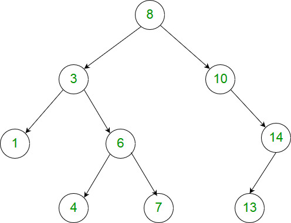

# [1026. 节点与其祖先之间的最大差值](https://leetcode-cn.com/problems/maximum-difference-between-node-and-ancestor/)

## 题目描述

给定二叉树的根节点 root，找出存在于不同节点 A 和 B 之间的最大值 V，其中 V = |A.val - B.val|，且 A 是 B 的祖先。

（如果 A 的任何子节点之一为 B，或者 A 的任何子节点是 B 的祖先，那么我们认为 A 是 B 的祖先）

 

示例：



        输入：[8,3,10,1,6,null,14,null,null,4,7,13]
        输出：7
        解释： 
        我们有大量的节点与其祖先的差值，其中一些如下：
        |8 - 3| = 5
        |3 - 7| = 4
        |8 - 1| = 7
        |10 - 13| = 3
        在所有可能的差值中，最大值 7 由 |8 - 1| = 7 得出。
 

提示：

        树中的节点数在 2 到 5000 之间。
        每个节点的值介于 0 到 100000 之间。

## 解题思路

深度优先遍历， 在遍历的时候计算父子子孙节点之间的差值， 记录下差值最大的那个。

```c++
/**
 * Definition for a binary tree node.
 * struct TreeNode {
 *     int val;
 *     struct TreeNode *left;
 *     struct TreeNode *right;
 * };
 */

#define N 5000

int road[N];
int roadEnd = 0;
int ans = 0;

int abs2(int a, int b)
{
    if (a > b) {
        return a - b;
    } else {
        return b - a;
    }
}
// 计算新入栈的元素和栈内其他元素的差的绝对值
// 并更新 ans
void compute(int *road, int roadEnd)
{
    int i, diff;
    for (i = 0; i < roadEnd - 1; i++) {
        diff = abs2(road[i], road[roadEnd - 1]);
        if (diff > ans) {
            ans = diff;
        }
    }
    printf("%d ", ans);
}
void dfs(struct TreeNode* root, int *road, int *roadEnd)
{
    road[(*roadEnd)++] = root->val;
    compute(road, *roadEnd);
    if (root->left) {
        dfs(root->left, road, roadEnd);
    }
    if (root->right) {
        dfs(root->right, road, roadEnd);
    }
    (*roadEnd)--;
    return;
}
int maxAncestorDiff(struct TreeNode* root){
    if (root == NULL) {
        return 0;
    }
    roadEnd = 0;
    ans = 0;
    dfs(root, road, &roadEnd);
    return ans;
}
```