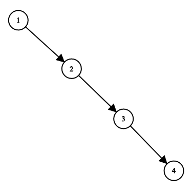

# [1382. 将二叉搜索树变平衡](https://leetcode-cn.com/problems/balance-a-binary-search-tree/)

## 题目描述

给你一棵二叉搜索树，请你返回一棵 平衡后 的二叉搜索树，新生成的树应该与原来的树有着相同的节点值。

如果一棵二叉搜索树中，每个节点的两棵子树高度差不超过 1 ，我们就称这棵二叉搜索树是 平衡的 。

如果有多种构造方法，请你返回任意一种。

 

示例：



        输入：root = [1,null,2,null,3,null,4,null,null]
        输出：[2,1,3,null,null,null,4]
        解释：这不是唯一的正确答案，[3,1,4,null,2,null,null] 也是一个可行的构造方案。
 

提示：

        树节点的数目在 1 到 10^4 之间。
        树节点的值互不相同，且在 1 到 10^5 之间。

## 解题思路

```c
#define N 10002

/**
 * Definition for a binary tree node.
 * struct TreeNode {
 *     int val;
 *     struct TreeNode *left;
 *     struct TreeNode *right;
 * };
 */
void middle(struct TreeNode* root, int *arr, int *arrEnd)
{
    if (root == NULL) return;
    if (root->left) {
        middle(root->left, arr, arrEnd);
    }
    arr[(*arrEnd)++] = root->val;
    if (root->right) {
        middle(root->right, arr, arrEnd);
    }
    return;
}

struct TreeNode* balanceDFS(int *arr, int start, int end)
{
    if (start > end) return NULL;

    if (start == end) {
        struct TreeNode* newNode = (struct TreeNode*)malloc(sizeof(struct TreeNode));
        newNode->val = arr[start];
        newNode->left = NULL;
        newNode->right = NULL;
        return newNode;
    }

    int mid = (end + start) / 2;
    struct TreeNode* newNode = (struct TreeNode*)malloc(sizeof(struct TreeNode));
    newNode->val = arr[mid];
    newNode->left = balanceDFS(arr, start, mid - 1);
    newNode->right = balanceDFS(arr, mid + 1, end);
    return newNode;
}

struct TreeNode* balanceBST(struct TreeNode* root){
    if (root == NULL) return root;

    int *array = (int*)malloc(sizeof(int) * N);
    int arrayEnd = 0;

    middle(root, array, &arrayEnd); // 中序遍历得到排序好的数组
    for (int i = 0; i < arrayEnd; i++) {
        printf("%d ", array[i]);
    }

    int mid = (arrayEnd - 1) / 2;
    root = (struct TreeNode*)malloc(sizeof(struct TreeNode));
    root->val = array[mid];
    root->left = balanceDFS(array, 0, mid - 1);
    root->right = balanceDFS(array, mid + 1, arrayEnd - 1);

    free(array);

    return root;
}
```