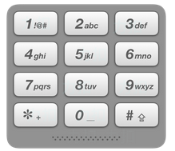

# [17. 电话号码的字母组合](https://leetcode-cn.com/problems/letter-combinations-of-a-phone-number)

## 题目描述

给定一个仅包含数字 2-9 的字符串，返回所有它能表示的字母组合。

给出数字到字母的映射如下（与电话按键相同）。注意 1 不对应任何字母。

示例:

    输入："23"
    输出：["ad", "ae", "af", "bd", "be", "bf", "cd", "ce", "cf"].

说明:
尽管上面的答案是按字典序排列的，但是你可以任意选择答案输出的顺序。

## 解题思路

2 对应 "abc", 3 对应 "def", 所有可能的结果可以用两重循环遍历得到。
但是本题给出的输入是不确定有多少个的，无法用多重循环遍历，这种情况用递归实现就比较容易。

递归的时候，函数中有一个for循环，用来尝试每一个可能的字母。

## AC代码

- [C](17.c)
- [C++](17.cpp)
- [Python](17.py)