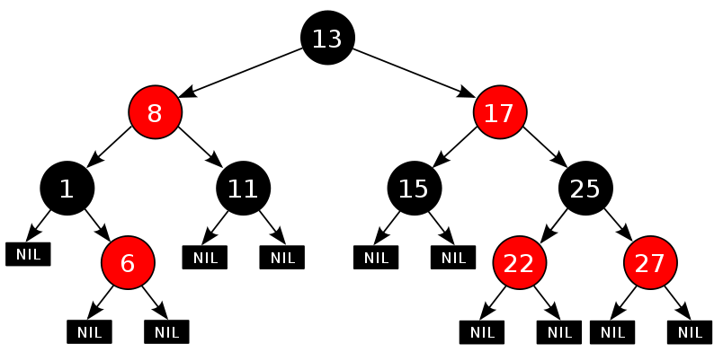

# 二叉树

树是没有环的图。树和链表、图都有关联。链表是树的一种特殊情况，而图都可以对应一棵生成树。学习完链表，学习树，然后学习图，是一个比较容易接受的过程。每个节点最多有两个子节点的树叫做二叉树。二叉树是递归定义的，这导致很多涉及二叉树的问题都可以用递归的方法求解。按照节点数目的不同，二叉树的类型有：完全二叉树，满二叉树和完美二叉树。

## 二叉树的通用性质

- 二叉树的第i层节点数目至多是`2^(i-1); (i>=1)`
- 深度为K的二叉树至多有`2^(K-1)`个节点。
- 二叉树中出度为2的节点数目记作n2, 叶节点记作n0; 则有`n0 = n2 + 1`
- 深度为n的完美二叉树，其节点的数目是`2^n -1`, 叶节点数目是`2^(n-1)`, 非叶节点的数目是`2^(n-1)-1`
- 节点数目为n的完美二叉树，深度是`log2(n+1)`
- 节点数目为n的完全二叉树，深度是`[log2(n)] + 1`  其中[]表示向下取整

## 二叉树的定义

二叉树的结构和双向链表比较相似，需要两个指针分别指向左孩子和右孩子。

```c
// 定义二叉树的结构
class TreeNode {
public:
   int val;
   TreeNode *left, *right;
   TreeNode(int val) {
       this->val = val;
       this->left = this->right = nullptr;
   }
}
```

## 二叉树的创建(生成)

创建一棵二叉树有多种方式，算法中指定二叉树通常使用"#"表示不存在的节点，这里我们采用两个遍历序列的方式来确定一棵二叉树的结构。前序遍历序列和中序遍历序列可以唯一的确定一颗二叉树的结构，后序遍历序列和中序遍历序列也可以唯一的确定一棵二叉树的结构。

### 根据前序遍历和中序遍历重建二叉树

根据二叉树的前序遍历和中序遍历的结果创建二叉树，根据前序遍历序列和中序遍历序列可以唯一的确定一棵二叉树。
假设前序遍历的序列是pre; 中序遍历的序列是vin;里面都不含有重复数字；首先确定根节点，肯定是pre[0], 然后在vin中寻找pre[0], 它前面的一定是左子树上的，后面的都是右子树上的。假设pre[0]出现在vin[3],可以知道左子树上有三个节点，分别是vin[0],vin[1],vin[2], 在pre中从pre[0]以后数3个数字这三个数字一定是位于左子树上的，剩下的属于右子树。分别按照上面的方法递归处理左右子树，直到只剩下一个元素，返回答案；举例来说，假设`pre = [1,2,4,7,3,5,6,8] `   `vin=[4,7,2,1,5,3,8,6]`第一次： 可知1是根，2，4，7是1的左子树上的，3,5,6,8,是1的右子树上的。 分别处理序列`[2,4,7] [4,7,2]` 和` [3,5,6,8] [5,3,6,8]`第二次： 对于`[2,4,7] [4,7,2]` 可以得到2是根，而4，7都是左子树上的， 接着处理`[4,7] [4,7]` 此时4是根，而7位于右子树上，这边处理完毕；对于`[3,5,6,8] [5,3,8,6]` 可以得到3是根，5是左子树上的，`[6,8]`是右子树上的。接着处理`[6,8][8,6]` 此时6是根，而8位于左子树上。

综合上面的分析，可以得到这个二叉树的形状如下：


```c
//根据前序遍历和中序遍历重建二叉树
TreeNode* reConstructBinaryTree(vector<int> pre,vector<int> vin) {
        if(pre.empty() || vin.empty()){return nullptr;}
        TreeNode* node = new TreeNode(pre[0]);// 先建立根节点
        int len = pre.size();
        for(size_t i=0;i<vin.size();++i){
            if(vin[i] == pre[0]){
                // 找到了中序遍历的根节点，则左面的全部是左子树，右面的全部是右子树。
                vector<int> left_pre(i,0);
                vector<int> left_vin(i,0);
                vector<int> right_pre(len-1-i,0);
                vector<int> right_vin(len-1-i,0);
                copy(vin.begin(),vin.begin()+i,left_vin.begin());
                copy(vin.begin()+i+1,vin.end(),right_vin.begin());
                copy(pre.begin()+1,pre.begin()+1+i,left_pre.begin());
                copy(pre.begin()+i+1,pre.end(),right_pre.begin());
                node->left =  reConstructBinaryTree(left_pre,left_vin);
                node->right = reConstructBinaryTree(right_pre,right_vin);
            }

        }
        return node;
```

[leetcode](https://leetcode.com/problems/construct-binary-tree-from-preorder-and-inorder-traversal/#/description)  [gist](https://gist.github.com/FF120/8c0508c1412cf1ca486dc10695ea1c94)

### 根据后序遍历和中序遍历重建二叉树

```c
//后序遍历和中序遍历重建二叉树
TreeNode* buildTree(vector<int>& inorder, vector<int>& postorder) {
    if (inorder.empty() || postorder.empty()) { return nullptr; }
    TreeNode *node = new TreeNode(postorder[postorder.size()-1]);// 先建立根节点
    int len = inorder.size();
    for (size_t i = 0; i < inorder.size(); ++i) {
        if (inorder[i] == postorder[postorder.size()-1]) {
            // 找到了中序遍历的根节点，则左面的全部是左子树，右面的全部是右子树。
            vector<int> left_post(i, 0);
            vector<int> left_vin(i, 0);
            vector<int> right_post(len - 1 - i, 0);
            vector<int> right_vin(len - 1 - i, 0);
            copy(inorder.begin(), inorder.begin() + i, left_vin.begin());
            copy(inorder.begin() + i + 1, inorder.end(), right_vin.begin());
            copy(postorder.begin(), postorder.begin() + i, left_post.begin());
            copy(postorder.begin() + i, postorder.end()-1, right_post.begin());
            node->left = buildTree(left_vin,left_post);
            node->right = buildTree(right_vin,right_post);
        }
    }
    return node;
}
```

[leetcode](https://leetcode.com/problems/construct-binary-tree-from-inorder-and-postorder-traversal/#/description)  [gist](https://gist.github.com/FF120/86ed96f2c2a7c110119e191ddcc94cd8)

## 二叉树的深度

从根节点到叶节点经过的节点数量定义为二叉树的深度。

### 最大深度

```c
 // 二叉树的最大深度
int maxDepth2(TreeNode *root, const int dep){
    if(!root) return dep;
    if(!root->left && !root->right) return dep+1;
    if(root->left && !root->right) return maxDepth2(root->left,dep+1);
    if(root->right && !root->left) return maxDepth2(root->right,dep+1);     
    return max(maxDepth2(root->left,dep+1),maxDepth2(root->right,dep+1));   
}
```

### 最小深度

```c
// 二叉树的最小深度
int minDepth2(TreeNode* root,const int dep){
    if(!root) return dep;
    if(!root->left && !root->right) return dep+1;
    if(root->left && !root->right)  return minDepth2(root->left,dep+1);
    if(!root->left && root->right)  return minDepth2(root->right,dep+1);
    return min(minDepth2(root->left,dep+1),minDepth2(root->right,dep+1));
}
```

## 二叉树的遍历

二叉树有三种常见的遍历方式：前序遍历、中序遍历、后序遍历。前中后指的都是根节点相对于左右孩子节点的顺序。所以前序遍历的顺序是 `root-left-right`, 中序遍历的顺序是 `left-root-right`, 后序遍历的顺序是 `left-right-root`. 

### 前序遍历(递归)

**前序遍历遍历的步骤**：

1. 输出当前节点
2. 如果有左孩子，用左孩子做参数递归
3. 如果有右孩子，用由孩子做参数递归

```c
// 前序遍历
 vector<int> preorderTraversal(TreeNode *root) {
        // write your code here
        vector<int> re;
        if(root == nullptr) return re;
        re.push_back(root->val);
        if(root->left){
            vector<int> ll = preorderTraversal(root->left);
            re.insert(re.end(), ll.begin(), ll.end());
        }
        if(root->right){
            vector<int> rr = preorderTraversal(root->right);
            re.insert(re.end(), rr.begin(), rr.end());
        }
        return re;
    }
```

### 前序遍历(非递归)

非递归的实现，递归函数的实现是使用堆栈的方式，所以把递归调用的函数改写成非递归的形式一般也是使用堆栈作为数据结构。

**前序遍历的非递归遍历步骤**

1. 输出当前的节点值，并把当前的节点压入栈
2. `current = current->left`;循环以上步骤直到没有左孩子，执行下面的步骤
3. 取栈顶元素的右孩子，弹出栈顶元素，然后回到步骤1.

```c
//前序遍历的非递归实现
vector<int> preorderTraversal(TreeNode *root) {
	vector<int> re;
	 if(root == nullptr) return re;
	 stack<TreeNode*> s;
	 TreeNode *tmp = root;
	 while(tmp!=nullptr || !s.empty()){ // 逻辑或是短路的
		while(tmp!=nullptr){
			re.push_back(tmp->val);
			s.push(tmp);
			tmp = tmp->left;
		}
		// 循环退出说明没有了左孩子
		if(!s.empty()){
		   tmp = s.top();
		   s.pop();
		   tmp = tmp->right;
		}
	 }
	 return re;
}
```

### 中序遍历(递归)

**中序遍历遍历的步骤**

1. 如果当前的节点有左孩子，用左孩子作为参数递归
2. 输出当前节点
3. 如果当前节点有右孩子，用右孩子作为参数递归

```c
// 中序遍历的递归实现
vector<int> inorderTraversal(TreeNode *root) {
        // write your code here
        vector<int> re;
        if(root == nullptr) return re;
        if(root->left){
            vector<int> ll = inorderTraversal(root->left);
            re.insert(re.end(),ll.begin(),ll.end());
        }
        re.push_back(root->val);
        if(root->right){
            vector<int> rr = inorderTraversal(root->right);
            re.insert(re.end(),rr.begin(),rr.end());
        }
        return re;
    }
```

### 中序遍历(非递归)

**中序遍历的非递归实现**

1. 对于当前的节点，放入堆栈，然后搜索有没有左孩子，一直向下搜索到没有左孩子为止。
2. 从堆栈取出栈顶元素，输出，然后搜索右孩子

```c
//中序遍历的非递归实现
 vector<int> inorderTraversal(TreeNode * root) {
        // write your code here
        vector<int> re;
        if(root == nullptr) return re;
        
        TreeNode* iter = root;
        stack<TreeNode*> s;
        
        while(iter || !s.empty()){
            while(iter){
                s.push(iter);
                iter = iter->left;
            }
            if(!s.empty()){
                iter = s.top();
                s.pop();
                re.push_back(iter->val);
                iter = iter->right;
            }
        }
        
        return re;
    }
```

### 后序遍历(递归)

**后序遍历遍历的步骤是**

1. 如果当前节点有左孩子，用左孩子作为参数递归
2. 如果当前节点有右孩子，用右孩子作为参数递归
3. 输出当前节点

```c
// 后续遍历的递归实现
 vector<int> postorderTraversal(TreeNode *root) {
        // write your code here
        vector<int> re;
        if(root == nullptr) return re;
        if(root->left){
            vector<int> ll = postorderTraversal(root->left);
            re.insert(re.end(),ll.begin(),ll.end());
        }
        if(root->right){
            vector<int> rr = postorderTraversal(root->right);
            re.insert(re.end(),rr.begin(),rr.end());
        }
        re.push_back(root->val);
        return re;
    }
```

### 后序遍历(非递归)

**后序遍历的非递归实现**

第一种思路：对于任一结点P，将其入栈，然后沿其左子树一直往下搜索，直到搜索到没有左孩子的结点，此时该结点出现在栈顶，但是此时不能将其出栈并访问，因此其右孩子还为被访问。所以接下来按照相同的规则对其右子树进行相同的处理，当访问完其右孩子时，该结点又出现在栈顶，此时可以将其出栈并访问。这样就保证了正确的访问顺序。可以看出，在这个过程中，每个结点都两次出现在栈顶，只有在第二次出现在栈顶时，才能访问它。因此需要多设置一个变量标识该结点是否是第一次出现在栈顶。

```c
//后序遍历的非递归实现

```

第二种思路：要保证根结点在左孩子和右孩子访问之后才能访问，因此对于任一结点P，先将其入栈。如果P不存在左孩子和右孩子，则可以直接访问它；或者P存在左孩子或者右孩子，但是其左孩子和右孩子都已被访问过了，则同样可以直接访问该结点。若非上述两种情况，则将P的右孩子和左孩子依次入栈，这样就保证了每次取栈顶元素的时候，左孩子在右孩子前面被访问，左孩子和右孩子都在根结点前面被访问。

```c
// 后序遍历的非递归实现
vector<int> postOrder(TreeNode *root)
{
    vector<int> re;
    if(root == nullptr) return re;

    TreeNode *p = root;
    stack<TreeNode *> s; 
    TreeNode *last = root;
    s.push(p);
    while (!s.empty())
    {
        p = s.top();
        if( (p->left == nullptr && p->right == nullptr) || (p->right == nullptr && last == p->left) || (last == p->right) )
        {
            re.push_back(p->val);
            last = p;
            s.pop();
        }
        else
        {
            if(p->right)
                s.push(p->right);
            if(p->left)
                s.push(p->left);
        }
    }
    return re;
}

```

### 层次遍历

二叉树的层次遍历类似与图的广度优先搜索，可以使用队列来实现。思路是： 使用两个队列保存相邻两层的节点，循环输出每层的节点

**层次遍历遍历的步骤**

> 1. 初始化两个队列d1,d2;令d1保存root,d2为空
> 2. 清空d2,遍历d1中的节点，把d1中节点的所有孩子节点按照顺序放入d2中
> 3. 打印d1中的节点
> 4. 交换d1和d2;转到2
> 
> 循环直到d2中为空，结束。

```c
// 从底向上层次遍历二叉树
 vector<vector<int>> levelOrderBottom(TreeNode *root) {
        // write your code here
        vector<vector<int>> result;
        vector<TreeNode*> v1,v2;
        if(root == nullptr){
            return result;
        }
        v1.push_back(root);
        while(!v1.empty()){
            // 遍历v1中的所有节点，将下一层节点保存在v2中
            for(int i=0;i<v1.size();i++){
                if(v1[i]->left){
                    v2.push_back(v1[i]->left);
                }
                if(v1[i]->right){
                    v2.push_back(v1[i]->right);
                }
            }
            vector<int> tmp;
            //打印v1
            for(int i=0;i<v1.size();i++){
                tmp.push_back(v1[i]->val);
            }
            result.insert(result.begin(),tmp);
            swap(v1,v2);
            v2.clear();
        }
        return result;
 }
```

```c
// 自顶向下遍历二叉树
 vector<vector<int>> zigzagLevelOrder(TreeNode *root) {
        // write your code here
        vector<vector<int>> result;
        if(!root) return result;
        vector<TreeNode*> v1,v2;
        v1.push_back(root);
        int level = 1;
        while(!v1.empty()){
            //遍历v1中的节点，把v1中所有节点的下一级节点存储在v2中
            for(int i=0;i<v1.size();i++){
                if(v1[i]->left){
                    v2.push_back(v1[i]->left);
                }
                if(v1[i]->right){
                    v2.push_back(v1[i]->right);
                }
            }
            // 打印v1中的节点,如果level 是奇数，则从左向又打印，
            // 如果level是偶数，则从右向左打印
            vector<int> tmp;
            if(level % 2 == 0){
                for(int i=v1.size()-1;i>=0;i--){
                    tmp.push_back(v1[i]->val);
                }
            }
            if(level % 2 ){
                for(int i=0;i<v1.size();i++){
                    tmp.push_back(v1[i]->val);
                }
            }
            result.push_back(tmp);
            // 更新该更新的数据
            swap(v1,v2);
            v2.clear();
            level++;
        }
        return result;
    }
```

```c
// 之字形遍历二叉树
vector<vector<int> > Print(TreeNode* pRoot) {
    vector<vector<int> > output;
    vector<int> row;
    if(pRoot == nullptr) return output;
    vector<TreeNode*> first;
    vector<TreeNode*> second;
    bool odd = true;
    first.push_back(pRoot);
    while(!first.empty()){
        if(odd){
            for (int i = 0; i < first.size(); ++i) {
                row.push_back(first[i]->val);
                if(first[i]->left){
                    second.push_back(first[i]->left);
                }
                if(first[i]->right){
                    second.push_back(first[i]->right);
                }
            }
            output.push_back(row);
            row.clear();
            swap(first,second);
            second.clear();
            odd = !odd;
        }else{
            for (int i = first.size()-1; i >= 0; --i) {
                row.push_back(first[i]->val);
            }
            output.push_back(row);
            row.clear();
            for (int j = 0; j < first.size(); ++j) {
                if(first[j]->left){
                    second.push_back(first[j]->left);
                }
                if(first[j]->right){
                    second.push_back(first[j]->right);
                }
            }
            swap(first,second);
            second.clear();
            odd = !odd;
        }
    }
    return output;
}
```

## 线索二叉树

### 原理

### 遍历二叉树

利用线索二叉树的思想可以实现在 O(1) 的空间复杂度对二叉树进行遍历。

#### morris 先序遍历

#### morris 中序遍历

#### morris 后序遍历

## 平衡二叉树

平衡二叉树的定义是：要么是一棵空树，要么根节点左右两棵子树的高度相差不超过1，并且左右两个子树也是平衡二叉树。

### 平衡二叉树的判定

```c
// 求树的最大深度
int maxDepth(TreeNode* root) {
    if(root == nullptr) return 0;
    int left = 1;
    int right = 1;
    int depth = 1;
    if(root->left){
        left += maxDepth(root->left);
    }
    if(root->right){
        right += maxDepth(root->right);
    }
    depth = max(left,right);
    return depth;
}
// 判断二叉树是否是平衡二叉树
bool isBalanced(TreeNode* root) {
    if(root == nullptr) return true;
    if(root->left == nullptr && root->right == nullptr) return true;
    if(root->left && root->right == nullptr){
        if(root->left->left== nullptr && root->left->right == nullptr){
            return true;
        }
        return false;
    }
    if(root->left == nullptr && root->right){
        if(root->right->left == nullptr && root->right->right == nullptr){
            return true;
        }
        return false;
    }
    bool left = isBalanced(root->left);
    bool right = isBalanced(root->right);
    int ldepth = maxDepth(root->left);
    int rdepth = maxDepth(root->right);
    if(abs(ldepth-rdepth)<=1 && left && right) return true;
    return false;
}
```

## 二叉搜索树(二叉查找树)

二叉查找树（Binary Search Tree），也称有序二叉树（ordered binary tree）,排序二叉树（sorted binary tree），是指一棵空树或者具有下列性质的二叉树：

>- 若任意结点的左子树不空，则左子树上所有结点的值均小于它的根结点的值；
>- 若任意结点的右子树不空，则右子树上所有结点的值均大于它的根结点的值；
>- 任意结点的左、右子树也分别为二叉查找树。
>- 没有键值相等的结点（no duplicate nodes）。

因为，一棵由n个结点，随机构造的二叉查找树的高度为lgn，所以顺理成章，一般操作的执行时间为O（lgn）.（至于n个结点的二叉树高度为lgn的证明，可参考算法导论 第12章 二叉查找树 第12.4节）。

但二叉树若退化成了一棵具有n个结点的线性链后，则此些操作最坏情况运行时间为O（n）。后面我们会看到一种基于二叉查找树-红黑树，它通过一些性质使得树相对平衡，使得最终查找、插入、删除的时间复杂度最坏情况下依然为O（lgn）。

### 二叉搜索树的基本操作

```python
class BinaryTree():
    def __init__(self, parent=None, left=None, right=None):
        self.parent = parent
        self.left = left
        self.right = right
        self.value = value

def insert(root, value):
    if not root:
        root = Node(value)
        return root
    if root.value == value:
        return root
    if value < root.value:
        root.left = insert(root.left, value)
    else:
        root.right = insert(root.right, value)
    return root

def search(root, value):
    if not root:
        return None
    if root.value == value:
        return root
    if value < root.value:
        return search(root.left, value)
    else:
        return search(root.right, value)

def delete(root, value):
    if root is None:
        return root
    if value < root.value:
        root.left = delete(root.left, value)
    elif value > root.value:
        root.right = delete(root.right, value)
    else:
        if root.left is None and root.right is None:
            return None
        if root.left is None:
            tmp = root.right
            root = None
            return tmp
        if root.right is None:
            tmp = root.left
            root = None
            return tmp
        current = root.right
        currentParent = None
        while current.left is not None:
            currentParent = current
            current = current.left
        currentParent.left = current.right
        root.value = current.value
    return root

def build(array):
    tree = None
    for v in array:
        tree = insert(tree, v)
    return tree

def max(root):
    if root is None:
        return None
    current = root
    while current.right is not None:
        current = current.right
    return current.value

def min(root):
    if root is None:
        return None
    current = root
    while current.left is not None:
        current = current.left
    return current.value

# 查找比node节点小的节点
def pre(node):
    if node is None:
        return None
    if node.left is not None:
        tmp = node.left
        while tmp.right is not None:
            tmp = tmp.right
        return tmp
    parent = node.parent
    current = node
    while parent is not None and parent.left == current:
        parent = parent.parent
        current = parent
    return parent

def next(node):
    if node is None:
        return None
    if node.right is not None:
        tmp = node.right
        while tmp.left is not None:
            tmp = tmp.left
        return tmp
    parent = node.parent
    current = node
    while parent is not None and parent.right == current:
        parent = parent.parent
        current = parent
    return parent
```

### 二叉搜索树的遍历序列

输入一个整数数组，判断该数组是不是某二叉搜索树的后序遍历的结果。如果是则输出Yes,否则输出No。假设输入的数组的任意两个数字都互不相同。

```c
// 思路：如果是二叉搜索树的后序遍历序列，那么最后一个一定是根，并且一定可以存在这样的关系：根前面的元素分成两部分，前一部分都比根小，后一部分都比根大，注意，这里前一部分和后一部分都可能为空。判断给出的序列是否满足这样的规律，然后分别递归判断左右两个分支。
bool bst(vector<int> &a,int l,int r){
       // 1. 找到第一个比根(r)小的元素，这里作为左右子树的分界
       if(l>=r) return true;
       int i=r-1;
       while(i>=l && a[i]>a[r]){
           --i;
       }
       // 此时i指向从后向前第一个小于a[r]的元素
       // 2. 检查从i到l的所有元素是否都小于a[r]
       int mid = i;
       while(i>=l){
           if(a[i] >= a[r]){
               return false;
           }
           i--;
       }
       // 此时 i应该等于l-1
       // 3. 划分出左右子树并且确保符合二叉搜索树的要求，递归左右子树，看是否符合要求
       return bst(a,l,mid) && bst(a,mid+1,r-1);

   }
   bool VerifySquenceOfBST(vector<int> sequence) {
   if(sequence.empty()) return false;
       return bst(sequence,0,sequence.size()-1);
   }
```


## AVL树

定义节点的平衡因子为 左子树的高度 - 右子树的高度， AVL树是满足所有节点的平衡因子都小于等于1的二叉搜索树。

如果插入，删除操作比较少， 查询操作比较多， 使用AVL树； 如果插入删除操作很频繁，使用红黑树，因为红黑树的插入删除效率高。

```python
def get_height(node):
    if node is None:
        return 0
    return node.height
def get_balance(node):
    if node is None:
        return 0
    balance = get_height(node.left) - get_height(node.right)
    return balance
def left_rotate(node):
    node_right = node.right
    node_right_left = node_right.left
    # 左旋
    node_right.left = node
    node.right = node_right_left
    # 更新高度
    node_left_height = get_height(node.left)
    node_right_height = get_height(node.right)
    root.height = 1 + max(node_left_height, node_right_height)
    # 返回旋转之后新的根
    return node_right
def right_rotate(node):
    node_left = node.left
    node_left_right = node_left.right
    # 右旋
    node_left.right = node
    node.left = node_left_right

    node_left_height = get_height(node.left)
    node_right_height = het_height(node.right)
    node.height = 1 + max(node_left_height, node_right_height)

    return node_left
def insert(root, value):
    if root is None:
        root = Node(value)
        return root
    if value == root.value:
        return root
    if value < root.value:
        root.left = insert(root.left, value)
    else:
        root.right = insert(root.right, value)

    # 插入完成之后调整
    left_height = get_height(root.left)
    right_height = get_height(root.right)
    root.height = 1 + max(left_height, right_height)
    balance = get_balance(root)
    # LL type
    if balance > 1 and value < root.left.value:
        return right_rotate(root)
    # RR type
    if balance < -1 and value > root.right.value:
        return left_rotate(root)
    # LR type
    if balance > 1 and value > root.left.value:
        return right_rotate(root)
    # RL type
    if balance < - 1 and value < root.right.value:
        return  left_rotate(root)
def delete(root, value):
    if root is None:
        return root
    if value < root.value:
        root.left = delete(root.left, value)
    elif value > root.value:
        root.right = delete(root.right, value)
    else:
        if root.left is None and root.right is None:
            return None
        if root.left is None:
            tmp = root.right
            root = None
            return tmp
        if root.right is None:
            tmp = root.left
            root = None
            return tmp
        current = root.right
        currentParent = None
        while current.left is not None:
            currentParent = current
            current = current.left
        currentParent.left = current.right
        root.value = current.value
    if root is None:
        return root
    root.height = 1 + max(get_height(root.left), get_height(root.right))
    balance = get_balance(root)
    # LL
    if balace > 1 and get_balance(root.left) >= 0:
        return right_rotate(root)
    # LR
    if balance > 1 and get_balance(root.left) < 0:
        root.left = left_rotate(root.left)
        return right_rotate(root)
    # RR
    if balance < -1 and get_balance(root.right) <= 0:
        return left_rotate(root)
    # RL
    if balance < -1 and get_balance(root.right) > 0:
        root.right = right_rotate(root.right)
        return left_rotate(root)
    return root
```

## 红黑树

参考文章：http://blog.csdn.net/chenhuajie123/article/details/11951777
红黑树，本质上来说就是一棵二叉查找树，但它在二叉查找树的基础上增加了着色和相关的性质使得红黑树相对平衡，从而保证了红黑树的查找、插入、删除的时间复杂度最坏为O(log n)

红黑树的性质：

> 1. 每个结点要么是红的，要么是黑的。
> 2. 根结点是黑的。
> 3. 每个叶结点（叶结点即指树尾端NIL指针或NULL结点）是黑的。
> 4. 如果一个结点是红的，那么它的俩个儿子都是黑的。
> 5. 对于任一结点而言，其到叶结点树尾端NIL指针的每一条路径都包含相同数目的黑结点。

红黑树的示例：



## 二叉树相关题目

[二叉树](../lintcode/tree.md)


