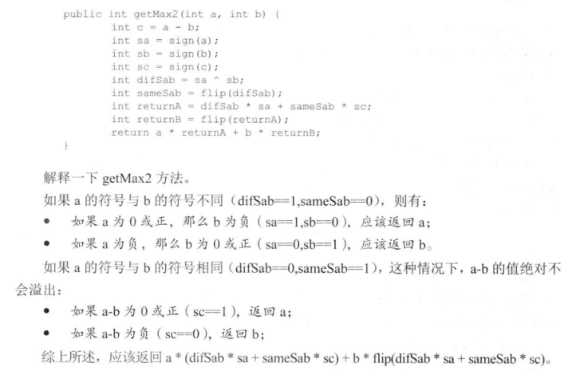
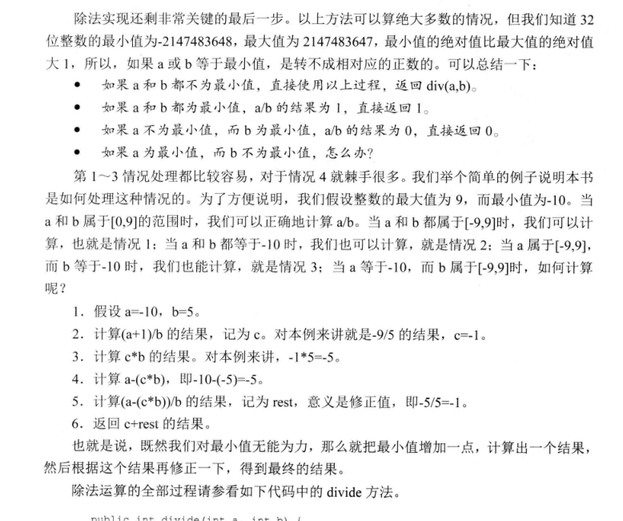

# 位运算

每种编程语言中都会有相关的位运算操作符，实现二进制的按位运算。
位运算有四种：与(&)，或(|)，非(~),异或(^)
熟悉每种位运算的特点，是做与位运算有关的题目的基础。

## 基础知识

### 与(&)
- `0&0=0; 0&1=0; 1&0=0; 1&1=1;`
- 仔细观察上面的操作，发现与操作的结果与二进制加法的进位规则非常一致。
`0+0=0 ; 0+1=0; 1+0=0; 1+1 = 1;` (此处等号后面的数字表示应该的进位)
- `n = n&(n-1)` 该操作的效果是把n的最后一个二进制1变为0. 此操作在涉及统计二进制数中1的个数的时候比较有用。
- `n = n&(~n+1)` 该操作的效果是把n的最右边的二进制1留下，其余的1全部置0.
- `n = n&(-n)` 该操作的效果是得到n的最后一个1

### 或(|)
- `0|0=0; 0|1=1; 1|0=1; 1|1=1;`
- ``

### 非(~)
- `~0=1; ~1=0`

### 异或(^)
- `0^0=0;1^1=0; 0^1=1;1^0=1;`
- 仔细观察上面的操作，发现异或操作的结果与二进制加法(忽略进位的情况下)规则一致。
`0+0=0;0+1=1;1+0=1;1+1=0;`(此处等号后面的数字是无进位加法的结果)
- `a^0=a; a^a=0; a^a^a=a` 偶数个a异或的结果是0，奇数个a异或的结果是a.
- `a^(a^b)=b;b^(a^b)=a;`  此规则可以用来交换两个数字，无需额外的空间

### 除法

- `(a)/(a & (-a));`, 去除末尾的若干个0. 例如 1011000 -> 1011

## 相关的应用

### 交换两个整数(不适用额外的空间)
此题是典型的利用异或运算的性质求解的题。
- `a^a = 0;  a^0 = a;`
- `a^(a^b) = b ; b^(a^b) = a ;`
具体的交换代码如下：
```C++
a = a^b;
b = a^b;
a = a^b;
```
分析一下这三行代码，我们把原来的a,b 记作a1,b1;把交换之后的记作a2,b2;最后要达到的结果是a2=b1;b2=a1;
第一行，`a=a^b`, 此时a的值已经改变，变成了`a^b`的值；
第二行变成`b = (a^b)^b = a`, 此时b的值已经改变，变成了a的值。
第三行，此时的`a=a^b`,而`b=a`,所以 `a=a^b=(a^b)^a=b`,a变成了b的值。
通过分析可以发现，其实充当暂存中间结果的变量是a, a先存储了a^b的值，然后去跟b异或得到a,再跟得到的a异或得到b.
而一般的需要第三个变量做中介的交换思路是首先把b存起来，因为在b=a时，b的值丢失了。之所以利用异或不怕b的值丢失，
是因为可以利用得到的a再次得到b.

### 不用比较找出两个数中较大的数



不用比较运算符比较两个数字的大小，可以使用减法运算符。
如果也不能使用减法运算符，可以考虑只使用位运算实现减法运算。
`a-b = c ` 如果`c>0,a>b;` 如果`c<0;c<b;`但是不幸的是，还是用到的`<`或者`>`
C++中有函数`signbit(x)`可以返回x的符号，使用的时候需要注意包含头文件`#include <cmath>`
另外需要注意的问题就是整数的溢出，`a-b`如果a是正数，b是负数，就会变成两个整数相加，这时候如果二者都接近
INT类型表示的边界，就会超出能够表示的最大的数的范围，产生正溢出。 同理，如果a是负数,b是正数，同样可能超出
能够表示的最小的负数的范围，产生负溢出。
幸运的是，如果知道二者异号，很容易判断谁大谁小。所以先判断是否是异号比较好，可以防止数据溢出产生错误。

```c
#include <iostream>
#include <cmath>
using namespace std;
//找出两个数中较大的数字，不使用任何比较运算
// 不比较两个元素，只能做差
//两个数做差或涉及到溢出的问题
// a - b 如果a 接近最大的整数，b接近最大的负数， 就会溢出
// a- b 如果a 接近最大的负数，b接近最大的正数，也会溢出
//所以先判断正负，再做差
int getMax(int a,int b){
    if(signbit(a) && !signbit(b)){return b;}
    if(signbit(b) && !signbit(a)){return a;}
    if(signbit(a-b)){return b;}
    return a;
}
int main() {
    cout<<getMax(5435651,-2393)<<endl;
    return 0;
}
```

### 不使用任何算术运算只使用位运算实现加减乘除

- 加法运算的思路
不考虑进位的情况下， `a^b` 就是`a+b`的结果
只考虑进位的情况下， `(a&b)<<1` 就是`a+b`的结果
所以综合二者，就能得到加法的正确答案。

- 减法的思路
`a-b = a+(-b);` 而`-b = ~b+1` 每个二进制位取反再加1.

- 乘法运算的思路
a*b 把b看成二进制位，每次把a左移（相当于乘以2），看b对应的位置上是否是1，
是1就将结果加到最终的结果上，是0就不加，返回最后的结果。

- 除法运算的思路



```C++
#include <iostream>
using namespace std;
/**
 * 用位运算实现加法运算
 * 按照二进制位加法 0 + 0 = 0 | 0 + 1 = 1 | 1 + 1 = 0
 * 如果不考虑进位，该规则正好与异或相同
 *
 * 考虑什么时候会产生进位 0 + 0 = 0 0 + 1 = 0 1+ 1 = 1
 * 该规则正好与  & 运算一致
 *
 * 所以分别考虑无进位相加和只考虑进位的结果  加在一起就好了。
 * @return
 */
int add(int a,int b){
    int sum =a ;
    while(b!=0){
        sum = a ^ b;
        b = (a & b) << 1;
        a = sum;
    }
    return a;
}
/**
 * 用位实现减法运算， 不能用-运算符
 * @param a
 * @param b
 * @return
 */
int minus2(int a,int b){
    // a - b == a + (-b)
    // -b == ~b + 1
    add(a,add(~b,1));
}
/**
 * 用位运算实现乘法
 *
 * @return
 */
int cheng(int a,int b){
    int sum = 0;
    while(b!=0){
        if(b&1!=0){
            sum = add(sum,a);
        }
        a<<=1;
        b>>=1;
    }
}

int main() {
    std::cout << cheng(-20,500) << std::endl;
    return 0;
}
```

### 整数的二进制表达中有多少个1

题目： 给定一个32位的整数，可0，可正，可负，返回该整数的二进制表达中有多少个1.
第一种方法是每次右移，然后统计1的个数，这种方法需要统计32次。
第二种方法只有原来数字中有多少个1有关，1越少速度越快。
n = n&(n-1) 该操作可以抹掉n最右边的1
n = n&(~n+1) 该操作可以得到n最右侧的1
使用上面的任意一种操作，可以设计算法实现只与1的个数有关的算法。

```C++
#include <iostream>
#include <cmath>
using namespace std;
/**
 * 统计整数的二进制表达中有多少个1
 * @return
 */
int getSum(int a){
   int sum = 0;
    while(a!=0){
        if(a&1 == 1){
            sum++;
        }
        a = a>>1;
    }
    return sum;
}
/**
 * n&(n-1)的作用就是消除n最右边的1
 * @param a
 * @return
 */
int getSumA(int a){
    int sum = 0;
    while(a!=0){
        a = a&(a-1);
        ++sum;
    }
    return sum;
}
int main() {
    std::cout << getSumA(8)<< std::endl;
    return 0;
}
```

### 找出一个只出现一次的数字

题目： 一个整数数组中，只有一个数字只出现了一次，其他所有数字都出现的两次，找出这个出现一次的数字。
变种： 一个整数数组中，只有一个数字出现了奇数次，其他所有的数字都出现了偶数次，找出这个出现奇数次的数字。
了解异或运算特点，`a^a = 0;  a^0 = a; a^a^a = a;`
出现偶数次的数在异或运算下都是0，出现奇数次的数异或之后就是它本身。
```C++
/**
 * 只有一个数字出现了奇数次，其余的数字都出现了偶数次，找出这个数字
 * 找出这个数字
 * @param v
 * @return
 */
int research(vector<int> v){
    int re = 0;
    for(auto a:v){
        re = re ^ a;
    }
    return re;
}
```
这个题目还可以从另外一个角度去理解，K个K进制的数字如果忽略进位相加的话，结果一定是0.那么nK个K进制的数字相加的话，结果
也一定是0. 而异或恰好是二进制无进位相加的实现。
了解了这一点，如果我们能够像异或这样，实现任意的K进制数无进位相加的结果，就可以解决下面这样的问题：
在其他数字都出现K次的数组中找出只出现一次的数字。

### 找出两个只出现一次的数字

题目：一个整数数组中，只有两个数字只出现了一次，其他所有数字都出现的两次，找出这两个数字。
思路：异或一遍之后得到的结果是a^b， a,b必然有一位是不同的(如果结果是0，那么a=b，说明并没有两个只出现一次的数字)。
根据这个二进制位将原来的数据分成两组，分别异或一遍即可得到这两个数字。

```C++
/**
 * 只有两个数出现了奇数次，找出这两个数
 * @param v
 * @return
 */
vector<int> research2(vector<int> v){
    vector<int> result;
    int r1 = 0;
    for(auto i : v){
        r1 = r1 ^ i;
    }
    int bit1 = r1 & (~r1 +1);
    int ab = 0; // 现在r1保存的是两个出现奇数次的数的异或
    for(auto j : v){
        if((j&bit1) != 0){
           ab = ab ^ j;
        }
    }
    result.push_back(ab);
    result.push_back(ab^r1);
    return result;
}

```

### 找出三个只出现一次的数字

题目：一个整数数组中，只有三个数字只出现了一次，其他所有数字都出现的两次，找出这三个数字。
思路：整体异或一遍，得到`x=a^b^c`. 设`f(x)`表示获取x的最后一位二进制1，例如`f(10100)=00100`. `n = f(x^a)^f(x^b)^f(x^c)`, 设n的最后一个二进制位1在第m位上。则有`x^a,x^b,x^c`只有一个数字在第m位上是1，其余的两个数字在第m位上都是0. (具体的推导过程参考[这里](http://zhedahht.blog.163.com/blog/static/25411174201283084246412/)).

算法步骤：

1. `abc = 0;  循环一遍：abc^=v[i]` , 得到`x=a^b^c`;
2. `g1 = 0; 循环一遍：g1^=getLastOne(abc^v[i]);`, 得到上面提到的n.
3. `g1 = getLastOne(g1)`, 得到分界数字，上面提到的第m位置1的数字。
4. 把所有满足`getLastOne( v[i] ^ abc ) == g1`条件的分成一组，该组中只包含`a,b,c`三个数字中的一个数字，异或一遍，得到a.
5. 剩下的就是找到两个数字了。

```c
int getLastOne(int n){
    return n & -(n-1);
}
void solve(vector<int> v,int &a,int &b,int &c){
    if(v.size() == 0) return;
    int abc = 0;
    for(int i=0;i<v.size();i++){
        abc = abc ^ v[i];
    }
    int g1 = 0;
    for(int i=0;i<v.size();i++){
        g1 = g1 ^ getLastOne(abc^v[i]);
    }
    // g1 只有1位是1，a,b,c中只有一个数字的这一位是1
    g1 = getLastOne(g1);
    a = 0;
    for(int i=0;i<v.size();i++){
        if(getLastOne( v[i] ^ abc ) == g1){
            a = a ^ v[i];
        }
    }
    int bc = abc ^ a;
    int g2 = getLastOne(bc);
    b = 0;
    for(int i=0;i<v.size();i++){
        if(v[i]&g2 && v[i]!=a){
            b = b ^ v[i];
        }
    }
    c = bc ^ b;
}
```

### 在其他数字都出现K次的数组中找到只出现一次的数

这里要明白一个规律，K个相同的K进制的数无进位相加的话，结果必然是0，因为所有是0的位还是0，所有不是0的位都加到了需要进位，除去进位，就是0.
明白了上面的一点，这个问题就容易解决了。首先把所有的数字转换成K进制，然后实现无进位相加的函数,再把结果转换回十进制输出即可。

另外一种解法：

可以统计所有数字每个二进制位上1的个数。然后每个二进制位对K取余，哪些出现K次的数字累加到对应位上的和肯定是K的倍数，取余之后就是0.剩下来的就是那个只出现一次的数字。

```c
/**
 * 将一个十进制的数转换成K进制
 * @param n
 * @return
 */
deque<int> Kin(int n,int k){
    deque<int> result;
    while(n/k != 0){
        result.push_front(n%k);
        n = n / k;
    }
    result.push_front(n);
    return result;
}
/**
 * 将K进制的deque转换成10进制
 * @param v
 * @return
 */
int Kinverse(deque<int> v,int k){
    int s = 0;
    int i = 0;
    while(!v.empty()){
        s += v.back() * std::pow(float(k),i);
        ++i;
    }
    return s;
}
/**
 * 实现两个vector按照K进制相加，忽略进位
 * @param v1
 * @param v2
 * @return
 */
deque<int> addV(deque<int> v1,deque<int> v2,int k){
    deque<int> result;
    if(v1.size() < v2.size()){
        auto tmp = v1;
        v1 = v2;
        v2 = tmp;
    }
    while(!v2.empty()){
        result.push_front( (v1.back() + v2.back() ) % k );
        v1.pop_back();
        v2.pop_back();
    }
    while(!v1.empty()){
        result.push_front( v1.back() );
        v1.pop_back();
    }
    return result;
}
/**
 * 实现v中的十进制数按照K进制相加，忽略进位，返回和
 * @param v
 * @param k
 * @return
 */
int Kplus(vector<int> v,int k){
    deque<int> result;
    for(auto i : v){
        result = addV(result,Kin(i,k),k);
    }
    return Kinverse(result,k);
}
int main() {
//    vector<int> v = {1,2,2,3,3,4,4,5,5,70};
//    auto reuslt = research2(v);
//    std::cout << reuslt[0] <<" "<<reuslt[1] << std::endl;
    vector<int> v = {3,4,5,6};
    cout<<Kplus(v,10);
    return 0;
}
```

```c
int solve(vector<int> &v,int k){
    vector<int> counts(64,0);
    for(int i=0;i<v.size();i++){
        int index = 0;
        int tmp = v[i];
        while(tmp){
            if(tmp&1){
                counts[index]++;
            }
            tmp = tmp>>1;
            index++;
        }
    }
    for(int i=0;i<v.size();i++){
        counts[i] = counts[i] % k;
    }
    int number = 0;
    int base = 1;
    for(int i=0;i<counts.size();i++){
        number += counts[i] * base;
        base  = base *2;
    }
    return number;
}
```

### 快速的求一个整数的N次方

```c
#include <iostream>
#include <vector>
#include <cmath>
#include <bitset>
using namespace std;
/**
 * f(n) = f(n-1) + f(n-2)
 * 1 1 2 3 5 8 ...
 * 要求实现O(logn)的算法
 * @return
 */
int getNum(int n){
    vector<int> v;
    for(int i=0;i<n;i++){
        if(i==0){
            v.insert(v.end(),1);
        }
        else if(i==1){
            v.insert(v.end(),1);
        }
        else{
            v.insert(v.end(),v[i-2]+v[i-1]);
        }
    }
    for(auto i:v){
        cout<<i<<endl;
    }
    return v.back();
}
/**
 *
 * @param n
 * @return
 */
int getNum2(int a,int n){
    int i = 0;
    double sum = 0;
    while(n!=0){
        int s = n&1;
        if(s==1){
            double t = powf(2,i);
            sum += powf(a,t);
        }
        n>>1;
        ++i;
    }
    cout<<sum<<endl;
}

int main() {
    int a = 3;
    int n = 5;
    while(n!=0){

    }
}
```
