# 最小生成树

**生成树**，是指图的一个最小连通的子图，该子图少一条边，就会不连通，多一条边，就会有环。

**最小生成树**，是指边有权值的情况下，找到权值的总和最小的那个连通子图。


如图，边上的数值如果代表距离的话，求最小生成树，就是求一个用最短的距离把所有点连接起来的方案。 我们通过仔细观察实验可以得出，最小的生成树是这样的。
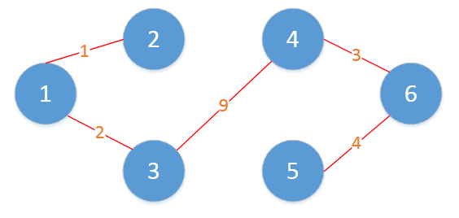

上面是一个最小生成树的实例，那么我们依照怎样的规则得出来的最小生成树呢，总不能靠看吧？

其实，这个问题用贪心法就可以解决。

## Kruskal算法
对于给定的无向有权图$G=(V,E)$，Kruskal算法描述如下：
> 1. 构造空集合A，并将图G中所有点加入集合A，此时A为有|V|棵树的森林。
> 2. 将图$G$中所有边按照权重进行排序，形成有序集合$B$。
> 3. 对于步骤2中排序后集合B中权重最小的边（u，v），尝试将（u，v）以及点u、v加入到集合A中。
> 4. 如果步骤3中尝试加入的点和边，对于图A而言，不形成回路，则添加点u、v及边（u，v），否则不添加。
> 5. 将步骤3处理的边（u，v）从集合B中删除。
> 6. 判断此时作为图的集合A，是否满足边的数量等于|V|-1（也即满足最小生成树的要求），如果是，则找到最小生成树，如果不是，则转至步骤3。

上面给出的例子，如果按照Kruskal算法，过程是下面这个样子的。
初始化的时候，A集合包含所有的顶点，B集合包含按照权值从小到达排序好的边。

第一次，添加1-->2, 得到
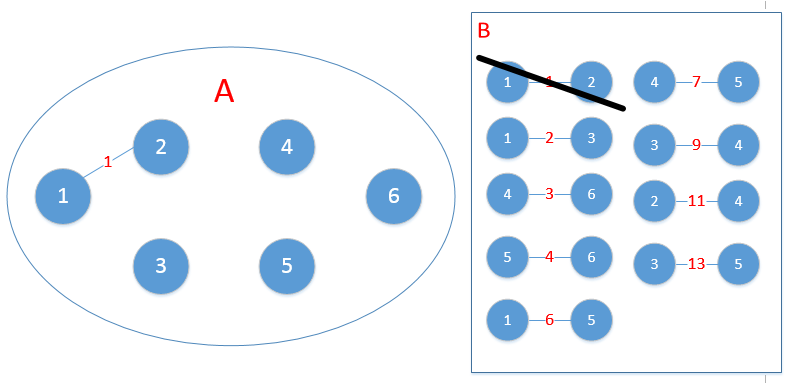
第二次，添加1-->3,得到
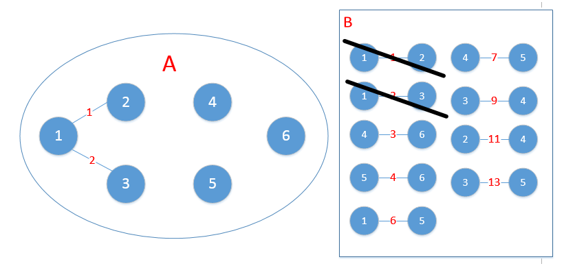
第三次，添加4-->6，得到
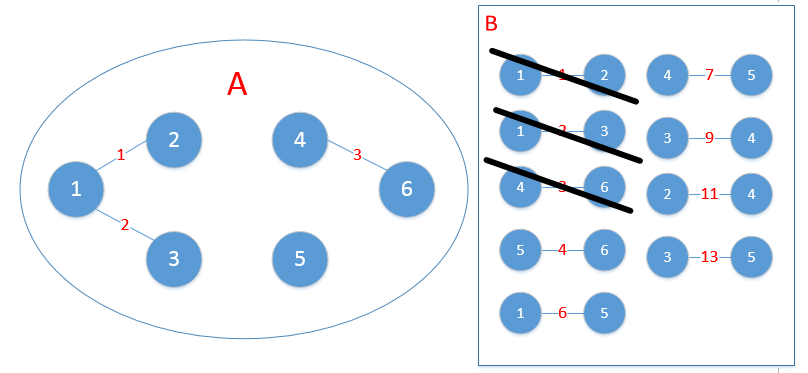
第四次，添加5-->6,得到

第五次，应该添加2-->3,但是如果添加了2-->3就形成的回路，所以该次不添加，从集合B中删除2-->3,继续看下一个。
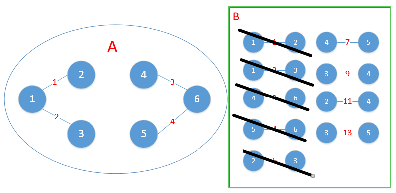
第六次，应该添加4-->5,但是如果添加了，就形成了回路，所以也应该跳过。
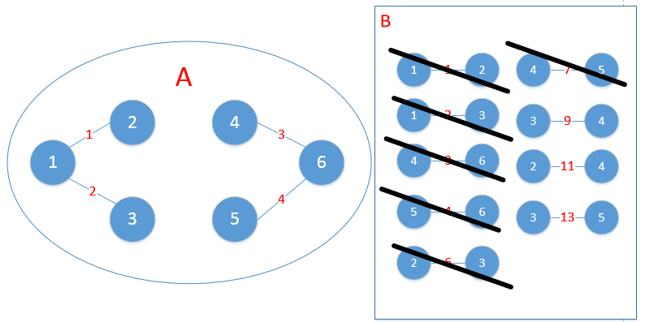
第七次，应该添加3-->4,得到
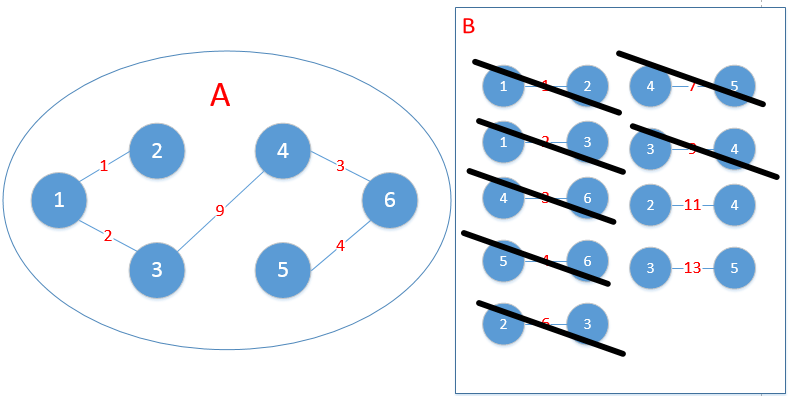
此时，所有的点都已经连通，所以算法结束。最小生成树找出来了。

分析整个过程，判断连通与否 和 判断算法是否结束 是每一步操作都要检查的，所以必须要有高效的方法。 判断算法是否结束可以用A的边的数目是否达到了顶点的数目-1， 判断联通性就要用到**并查集**了。并查集是一种多个树组成的数据结构，可以方便的查出同组不同组的问题。

使用并查集实现的Kruskal算法如下：

1. 把边按照从小到大排序
2. 每次选择最小的边，如果添加该边不会形成回路，则添加
3. 判断边的数量是否到达顶点的数量-1，如果没有转到2

```python
# vector3[] 表示vector3[0] -> vector3[1] 有一条权重为 vector3[2] 的边
# color[] 点的访问状态
# paraSet[] 并查集，用来判断是否会形成环

ansList = []
points = []

paraSet = [i for i in range(V)]
vector3.sort(lambda x:x[2])

def parent(paraSet, member):
    if paraSet[member] = member:
        return member
    paraSet[member] = parent(paraSet[member])
    return paraSet[member]

def merge(paraSet, u, v):
    uParent = parent(paraSet, u)
    vParent = parent(paraSet, v)
    if uParent != vParent:
        paraSet[vParent] = uParent

for u, v, w in vector3:
    if parent(paraSet, u) != parent(paraSet, v):
        ansList.append([u, v, w])
        merge(paraSet, u, v)
    if len(ansList) == V - 1:
        break  # 边数等于顶点数-1，得到结果
```

## prime算法
对于图G=（V，E），Prim算法描述如下：
> 1. 给定空集合A，以及任何一点v0属于{V}，将v0加入集合A中，此时A={v0}。
> 2. 对于集合A中的任意一点u，以及V-A中任意一点w，找到权重最小的边（u，w），常识将（u，w）加入集合A。
> 3. 判断步骤2中的边（u，w）是否使图A形成回路，如果形成回路，则不加入A，否则将点w和边（u，w）加入A。
> 4. 判断此时图G中所有点{V}是否已经全部加入到集合A中，如果是，则最小生成树已经找到，退出；否则，转步骤2。

上面的例子用prime算法来做的过程是：
初始化的时候，A是空的，V包含了所有的点。
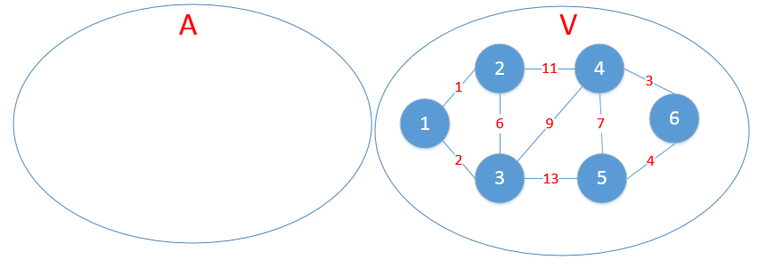
第一步，从V中任意找一个点加入集合A中；
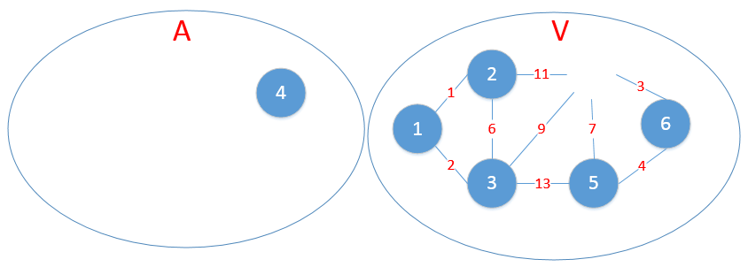
第二步，找到4和其余的顶点之间权重最小的边，是4--6,
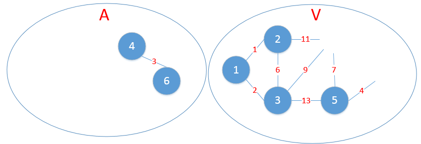
第三步，找到4，6和其余的顶点之间权重最小的边，5--6，
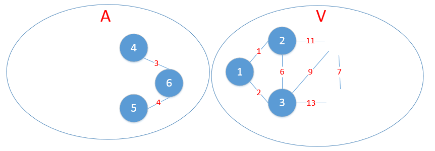
第四步，找到4，5，6和其余的顶点之间权重最小的边，4--3
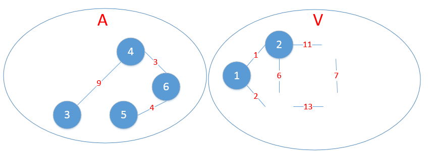
第五步，找到3，4，5，6和其余的顶点之间权重最小的边，1--3
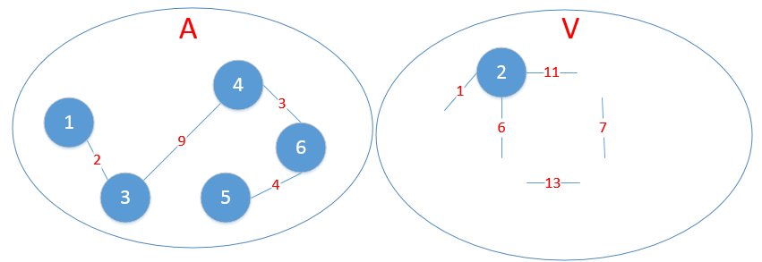
第六步，找到1，3，4，5，6和2之间权重最小的边，1--2，
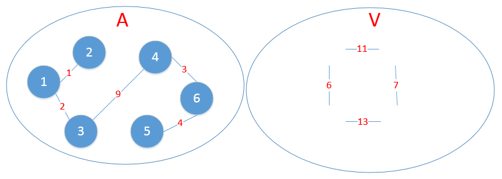
此时，所有的顶点都加入了集合A，算法结束。
可以看到，结果和上面的Kruskal算法算法是一致的。一个是从边来考虑，一个是从顶点来考虑，二者实际上都是贪心法的思路。

prime算法的核心是找到两个集合之间权重最小的边，这个可以用堆实现。
prime算法的一种实现：

1. 初始化空集合 A，B 集合包含所有的点
2. 从 B 中任意选择一个点移动到 A 中
3. 选择集合A和集合B中所有点之间的权重最小的那条边，如果不构成回路，添加该边
4. 重复3直到集合B为空

```python
import heapq

# 任意选择一点 start
# vector3[] 表示vector3[0] -> vector3[1] 有一条权重为 vector3[2] 的边
# color[] 点的访问状态
def prime(vector3, start):
    ansList = []
    color = [0] * V
    B = heapq.heapify()
    heapq.push((0, start, start)) # start 到 start 距离是 0
    while len(B) > 0:
        w, u, v = heapq.pop()
        if u != v:
            ansList.append((u,v,w))
        color[u] = 1
        for u, v, w in vector3[u]:
            if color[v] == 0:
                heapq.push((w, u, v))
    return ansList
```
