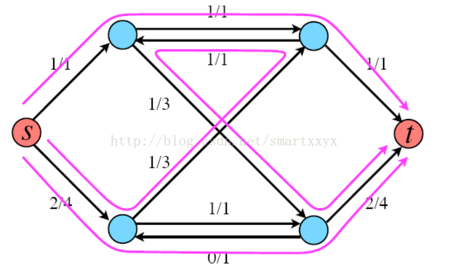
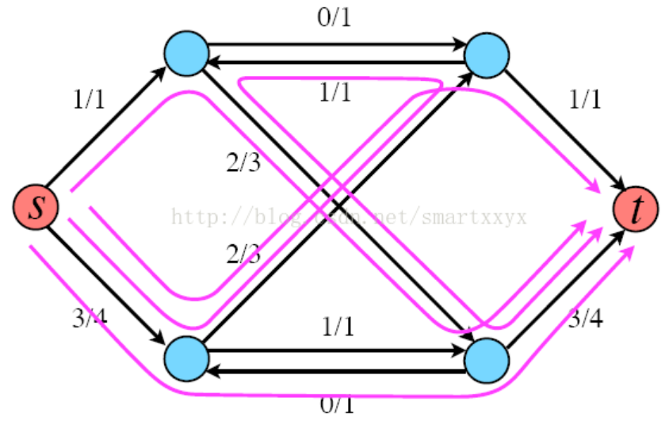

# 网络流

有一个自来水管道运输系统，起点是s，终点是t，途中经过的管道都有一个最大的容量。求从s到t的最大水流量是多少？

网络最大流问题是网络的另一个基本问题。许多系统包含了流量问题。例如交通系统有车流量，金融系统有现金流，控制系统有信息流等。许多流问题主要是确定这类系统网络所能承受的最大流量以及如何达到这个最大流量。

先介绍最大流问题额一般模型。

如图，要求从s到t的最大流是多少。我们可以很容易的看出该网络的最大流是4，s-->1 == 2 并且 s-->2 = 2. 线段上的数据表示线段上的最大容量，s表示起点，术语叫做源点(source),t是终点，术语叫做汇点(sink),边的容量记作$c$,实际边上流过的具体的值记作$f$. 最大流问题就是最大化从s出发的流量。

**流网络的值**

有时候，我们会提到流网络的大小，这个时候是指所有从源点出发的流之和。

## Ford-Fulkerson

网络最大流问题比较常见的是Ford-Fulkerson解法。该方法依赖于三种重要思想：残留网络，增广路径和割。

### 增广路径

增广路径可以看做是从源点s到汇点t之间的一条路径，沿该路径可以压入更多的流，从而增加流的值。
举个例子来说明下，如图所示，每条红线就代表了一条增广路径，当前s到t的流量为3。

当然这并不是该网络的最大流，根据寻找增广路径的算法我们其实还可以继续寻找增广路径，最终的最大流网络如下图所示，最大流为4。


### 残留网络(Residual Graph)

给定一个具体的流，除了这个流之外，网络上还能容纳的流叫做这个流对应的残留网络。可以简单的把残留网络理解为整个网络减去当前的流网络。

残留网络的具体计算方法：
给定一个流网络G和一个流，流的残留网$G_f$拥有与原网相同的顶点。原流网络中每条边将对应残留网中一条或者两条边，对于原流网络中的任意边(u, v)，流量为f(u, v)，容量为c(u, v)：
- 如果f(u, v) > 0，则在残留网中包含一条容量为f(u, v)的边(v, u);
- 如果f(u, v) < c(u, v)，则在残留网中包含一条容量为c(u, v) - f(u, v)的边(u, v)。

如上图所示，开始的时候，所有的流都为0，此时满足第二条，f(u,v) = 0 < c(u,v).所以残留网络与原来的网络相同。

在当前的残留网络（与原网络相同）随意确定一条增广路径，假设是`0-->1-->3-->5`，该路径的最大流量是2.
f(0,1)>0, 残留网络中有一条边(1,0) = 2, f(0,1) = c(0,1), 所以没有从0到1的边。
c(1,3)>f(1,3)>0, 所以残留网络中有两条边,(1,3)=3-2=1, (3,1)=f(1,3)=2.
c(3,5) = f(3,5)>0, 所以残留网络中有一条边，(5,2) = 2.
整个残留网络的变化如有图所示。

再从残留网络中找一条增广路径，这次我们找`0-->2-->4-->5`,最大流量是1.
按照残留网络的规则，计算之后的残留网络如右图所示。

继续从残留网络中找增广路径，可以寻找到一条`0-->2-->3-->1-->4-->5`的路径，注意`3-->1`就是原来的`1-->3`减去1，最大的流量是1. 根据上面的规则调整残留网络，如右图所示。
此时，残留网络中再也找不到任何一条从0到5的增广路径，所以过程结束，这个时候，我们发现，我们已经找到了最大流。上图左边所示的就是该网络的最大流，和我们最初的直观印象是一样的。

### 割

设整个图的顶点集合是V。所谓图的割，指的是边的集合，指的是对于某个顶点集合$S \subseteq V$,从S出发指向S外部的那些边的集合，记为割(S,V\S).
所以割是指一些边的集合。
这些边上的容量之和被称为割的容量。

**最小割问题**

对于给定的网络，为了保证没有从s到t的路径，需要删去的边的总容量最小是多少。其中$s \in S$且$t \in {V/S}$.

**最大流最小割定理**

一个网中所有流中的最大值等于所有割中的最小容量。
其实这个定理很容易从道理上想明白，一旦超出最小割，便总有边超出了边的容量，也就不存在可行的流了。

用上面用过的图来说明一下割的相关概念：

如图，流网络的一个割为s:{0,1,2},t:{3,4,5}, 通过割的流量定义为从s到t的所有流量之和(从t到s的流量记作负值)，所以这个割的流量是：2+1=3
割的容量记作所有从s到t的边的容量之和，所以是3+1+1+1 = 6.

从上面的定义可以简单的得到一点，任何一个割的流量都小于等于割的容量。
将上面的割的图形增加一个虚拟的节点s'，绘制成下面的形式：f1是流入S的流量，f2是从S到T的流量，f3是从T到S的流量。一个节点的流入流量等于流出的流量，所以有f2 = f1 + f3.


从这个图可以清晰的看出，流网络的值等于f1, 而割的流量等于f2-f3. 所以有流网络的值等于割的流量值。
最大流最小割定理定理的证明：http://www.cnblogs.com/luweiseu/archive/2012/07/14/2591573.html


### Ford-Fulkerson算法的实现

上面介绍残留网络的时候已经将的很清楚了，Ford-Fulkerson算法就是不断更新残留网络，从中找出可行的流，直到无法从残留网络中找出可行的流为止。
所以，简单的算法步骤可以表述为：
> 1. 初始化流flow = 0;
> 2. while(condition){
>   flow += path-flow
> }
> 此处的condition为 存在从s到t的增广路径，path-flow为该增广路径的值。
> 3. 输出flow.

可以看出，算法的主要部分在寻找增广路径上面。
参考文章：http://www.geeksforgeeks.org/ford-fulkerson-algorithm-for-maximum-flow-problem/

程序以这个实例作为输入：


```c
// C++ program for implementation of Ford Fulkerson algorithm
#include <iostream>
#include <limits.h>
#include <string.h>
#include <queue>
using namespace std;

// Number of vertices in given graph
#define V 6

/* Returns true if there is a path from source 's' to sink 't' in
  residual graph. Also fills parent[] to store the path */

//  使用宽度优先搜索搜索残留网络之中是否有增广路径
bool bfs(int rGraph[V][V], int s, int t, int parent[])
{
    // Create a visited array and mark all vertices as not visited
    bool visited[V];
    memset(visited, 0, sizeof(visited));

    // Create a queue, enqueue source vertex and mark source vertex
    // as visited
    queue <int> q;
    q.push(s);
    visited[s] = true;
    parent[s] = -1;

    // Standard BFS Loop   宽度优先搜索
    while (!q.empty())
    {
        int u = q.front();
        q.pop();

        for (int v=0; v<V; v++)
        {
            if (visited[v]==false && rGraph[u][v] > 0)
            {
                q.push(v);
                parent[v] = u;
                visited[v] = true;
            }
        }
    }

    // If we reached sink in BFS starting from source, then return
    // true, else false
    return (visited[t] == true);
}

// Returns the maximum flow from s to t in the given graph
int fordFulkerson(int graph[V][V], int s, int t)
{
    int u, v;

    // Create a residual graph and fill the residual graph with
    // given capacities in the original graph as residual capacities
    // in residual graph
    int rGraph[V][V]; // Residual graph where rGraph[i][j] indicates
    // residual capacity of edge from i to j (if there
    // is an edge. If rGraph[i][j] is 0, then there is not)
    // 初始化残留网络，刚开始的时候，残留网络和初始网络一致，见上面的讲解
    for (u = 0; u < V; u++)
        for (v = 0; v < V; v++)
            rGraph[u][v] = graph[u][v];

    int parent[V];  // This array is filled by BFS and to store path

    int max_flow = 0;  // There is no flow initially

    // Augment the flow while tere is path from source to sink
    //bfs(rGraph, s, t, parent) 实现了判断残留网络中是否存在增广路径
    while (bfs(rGraph, s, t, parent))
    {
        // Find minimum residual capacity of the edges along the
        // path filled by BFS. Or we can say find the maximum flow
        // through the path found.
        int path_flow = INT_MAX;
        //找到path_flow的值，path_flow的值等于增广路径中最小的边的容量。
        for (v=t; v!=s; v=parent[v])
        {
            u = parent[v];
            path_flow = min(path_flow, rGraph[u][v]);
        }

        // update residual capacities of the edges and reverse edges
        // along the path
        //更新残留网络
        for (v=t; v != s; v=parent[v])
        {
            u = parent[v];
            rGraph[u][v] -= path_flow;
            rGraph[v][u] += path_flow;
        }

        // Add path flow to overall flow
        max_flow += path_flow;
    }

    // Return the overall flow
    return max_flow;
}

// Driver program to test above functions
int main()
{
    // Let us create a graph shown in the above example
    int graph[V][V] = { {0, 16, 13, 0, 0, 0},
                        {0, 0, 10, 12, 0, 0},
                        {0, 4, 0, 0, 14, 0},
                        {0, 0, 9, 0, 0, 20},
                        {0, 0, 0, 7, 0, 4},
                        {0, 0, 0, 0, 0, 0}
    };

    cout << "The maximum possible flow is " << fordFulkerson(graph, 0, 5);

    return 0;
}
```

以上代码搜索增广路径使用的BFS，实际上还可以使用DFS，PFS等方法，参考文章：
http://www.cnblogs.com/luweiseu/archive/2012/07/14/2591573.html

**参考文献**

1. http://www.cnblogs.com/luweiseu/archive/2012/07/14/2591573.html
2. http://www.acmerblog.com/ford-fulkerson-6135.html
3. http://blog.csdn.net/smartxxyx/article/details/9293805
4. http://www.geeksforgeeks.org/ford-fulkerson-algorithm-for-maximum-flow-problem/


## Dinic算法

Dinic是一种比Ford-Fulkerson效率更高的算法，当数据较大的时候，可以考虑使用Dinic算法。

### 顶点的层次

在残留网络中，把顶点距离源点的距离定义为节点的层次，源点的层次为0，和源点直接相连的节点的层次是1.
**分层**： 将残留网络中所有节点的层次标记出来的过程。（注意不是所有的网络都可以分层）
**层次网络**：对残留网络进行分层后，删去比汇点Vt层次更高的顶点和与汇点Vt同层的顶点(保留Vt)，并删去这些顶点相关联的弧，再删去从某层顶点指向同层顶点和低层顶点的弧，所剩余的各条弧的容量与残留网络中的容量相同，这样得到的网络就是残留网络的子网络，称为层次网络，记为G''(V'',E'')。

根据层次网络定义，层次网络中任意的一条弧<u,v>，有满足level(u)+1 == level(v)，这条弧也叫允许弧。直观的说，层次网络是建立在残留网络基础之上的一张“最短路径图”。从源点开始，在层次网络中沿着边不管怎么走，到达一个终点之后，经过的路径一定是终点在残留网络中的最短路径。

### Dinic算法的思想

Dinic算法的思想也是分阶段地在层次网络中增广。它与最短增广路算法不同之处是：最短增广路每个阶段执行完一次BFS增广后，要重新启动BFS从源点Vs开始寻找另一条增广路;而在Dinic算法中，只需一次DFS过程就可以实现多次增广，这是Dinic算法的巧妙之处。Dinic算法具体步骤如下:

（1）初始化容量网络和网络流。

（2）构造残留网络和层次网络，若汇点不再层次网络中，则算法结束。

（3）在层次网络中用一次DFS过程进行增广，DFS执行完毕，该阶段的增广也执行完毕。

（4）转步骤（2）。

在Dinic的算法步骤中，只有第（3）步与最短增广路相同。在下面实例中，将会发现DFS过程将会使算法的效率有非常大的提高。
DFS增广过程示意：


### Dinic算法实现
```c
#include <iostream>
#include <cstdlib>
#include <cstdio>
#include <cstring>
#include <string>
#include <algorithm>
#include <queue>
using namespace std;

const int MAXN = 210;
const int MAXM = 210*210;
const int INF = 0x3f3f3f3f;

struct Edge
{
    int v, f;
    int next;
}edge[MAXM];

int n, m;
int cnt;

int first[MAXN], level[MAXN];
int q[MAXN];

void init()
{
    cnt = 0;
    memset(first, -1, sizeof(first));
}

void read_graph(int u, int v, int f)
{
    edge[cnt].v = v, edge[cnt].f = f;
    edge[cnt].next = first[u], first[u] = cnt++;
    edge[cnt].v = u, edge[cnt].f = 0;  //增加一条反向弧，容量为0
    edge[cnt].next = first[v], first[v] = cnt++;
}

int bfs(int s, int t) //构建层次网络
{
    memset(level, 0, sizeof(level));
    level[s] = 1;
    int front = 0, rear = 1;
    q[front] = s;
    while(front < rear)
    {
        int x = q[front++];
        if(x == t) return 1;
        for(int e = first[x]; e != -1; e = edge[e].next)
        {
            int v = edge[e].v, f = edge[e].f;
            if(!level[v] && f)
            {
                level[v] = level[x] + 1;
                q[rear++] = v;
            }
        }
    }
    return 0;
}

int dfs(int u, int maxf, int t)
{
    if(u == t) return maxf;
    int ret = 0;
    for(int e = first[u]; e != -1; e = edge[e].next)
    {
        int v = edge[e].v, f = edge[e].f;
        if(level[u] + 1 == level[v] && f)
        {
            int Min = min(maxf-ret, f);
            f = dfs(v, Min, t);
            edge[e].f -= f;
            edge[e^1].f += f;
            ret += f;
            if(ret == maxf) return ret;
        }
    }
    return ret;
}

int Dinic(int s, int t) //Dinic
{
    int ans = 0;
    while(bfs(s, t)) ans += dfs(s, INF, t);
    return ans;
}
```

**参考文献**

1. https://comzyh.com/blog/archives/568/
2. http://blog.csdn.net/wall_f/article/details/8207595
3. http://www.cnblogs.com/y-clever/p/6308820.html
4. http://blog.csdn.net/u012914220/article/details/23865829
5. http://blog.csdn.net/pi9nc/article/details/23339111
6. http://www.nocow.cn/index.php/Dinic#.E7.AE.97.E6.B3.95.E6.B5.81.E7.A8.8B
7. 2017ISAP 算法 ：http://www.renfei.org/blog/isap.html

## 二分图

给一个图的顶点着色，相邻的顶点着不同颜色，需要的最少的颜色数，叫做最小着色数。
最小着色数是2的图叫做二分图。

简单来说，如果图中点可以被分为两组，并且使得所有边都跨越组的边界，则这就是一个二分图。准确地说：把一个图的顶点划分为两个不相交集 U 和V ，使得每一条边都分别连接U、V中的顶点。如果存在这样的划分，则此图为一个二分图。二分图的一个等价定义是：不含有「含奇数条边的环」的图。图 1 是一个二分图。为了清晰，我们以后都把它画成图 2 的形式。


判断一个图是否是二分图，只需要从任意一个节点开始，遍历这个图，给当前节点和相邻节点然不同的色，然后判断有没有相邻的节点同色即可。

### 二分图的最大匹配和完美匹配

http://www.renfei.org/blog/bipartite-matching.html

最大匹配：一个图所有匹配中，所含匹配边数最多的匹配，称为这个图的最大匹配。图 4 是一个最大匹配，它包含 4 条匹配边。

完美匹配：如果一个图的某个匹配中，所有的顶点都是匹配点，那么它就是一个完美匹配。图 4 是一个完美匹配。显然，完美匹配一定是最大匹配（完美匹配的任何一个点都已经匹配，添加一条新的匹配边一定会与已有的匹配边冲突）。但并非每个图都存在完美匹配。

举例来说：如下图所示，如果在某一对男孩和女孩之间存在相连的边，就意味着他们彼此喜欢。是否可能让所有男孩和女孩两两配对，使得每对儿都互相喜欢呢？图论中，这就是完美匹配问题。如果换一个说法：最多有多少互相喜欢的男孩/女孩可以配对儿？这就是最大匹配问题。

基本概念讲完了。求解最大匹配问题的一个算法是匈牙利算法，下面讲的概念都为这个算法服务。

**交替路**：从一个未匹配点出发，依次经过非匹配边、匹配边、非匹配边…形成的路径叫交替路。

**增广路**：从一个未匹配点出发，走交替路，如果途径另一个未匹配点（出发的点不算），则这条交替路称为增广路（agumenting path）。例如，图 5 中的一条增广路如图 6 所示（图中的匹配点均用红色标出）：

增广路有一个重要特点：非匹配边比匹配边多一条。因此，研究增广路的意义是改进匹配。只要把增广路中的匹配边和非匹配边的身份交换即可。由于中间的匹配节点不存在其他相连的匹配边，所以这样做不会破坏匹配的性质。交换后，图中的匹配边数目比原来多了 1 条。

我们可以通过不停地找增广路来增加匹配中的匹配边和匹配点。找不到增广路时，达到最大匹配（这是增广路定理）。匈牙利算法正是这么做的。在给出匈牙利算法 DFS 和 BFS 版本的代码之前，先讲一下匈牙利树。

**匈牙利树**一般由 BFS 构造（类似于 BFS 树）。从一个未匹配点出发运行 BFS（唯一的限制是，必须走交替路），直到不能再扩展为止。例如，由图 7，可以得到如图 8 的一棵 BFS 树：
