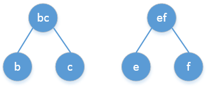
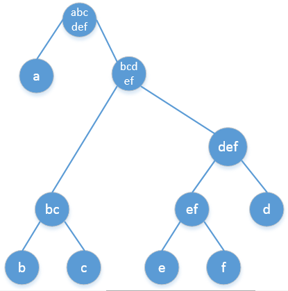
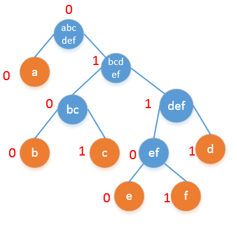
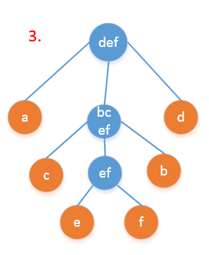
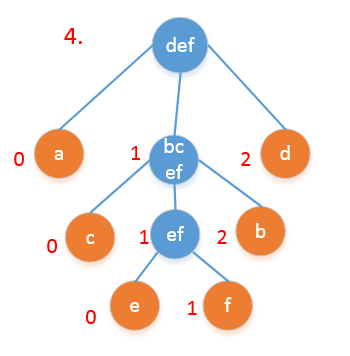

# 多叉树

记录不是二叉树的其他树型结构


## 一般树

学习树结构的时候，做了大量二叉树的题目，了解了二叉树的表示结构和各种操作。但是当遇到普通的树的时候，一时竟不知道如何表示。其实树就是没有环的图。所以用来表示图的两种方法都可以用来表示一般的树结构。

### 表示

**邻接表**

用一个二维的数组(或者链表)表示每个节点的相邻的节点有哪些。

**邻接矩阵**

用一个矩阵表示哪两个节点之间直接相连。

### 应用

#### 无根树化为有根树

将一棵树转换成以其中某个节点为根的树。

[hihocoder 1542](http://hihocoder.com/problemset/problem/1542)

```c
#include <bits/stdc++.h>

using namespace std;

const int maxn = 1005;

vector<int> v[maxn];

int n,rt;

int par[maxn];

void dfs(int x,int p)
{
    par[x] = p;
    for(int i=0;i<v[x].size();i++)
    {
        int toit = v[x][i];
        if(toit!=p)
            dfs(toit,x);
    }
}
int main()
{
    cin >> n >> rt;
    int a, b;
    for(int i=1;i<n;i++)
    {
        cin >> a >> b;
        v[a].push_back(b);
        v[b].push_back(a);
    }
    dfs(rt,0);
    for(int i=1;i<=n;i++)
        cout << par[i] << (i==n?'\n':' ');
    
    return 0;
}
```

## 霍夫曼编码

霍夫曼编码是一种无损编码方法，它是无损编码方案中最优的，基本思想是给出现频率高的字符以较短的编码，给出现频率低的字符以长的编码。本文将介绍霍夫曼编码的算法步骤和具体实现。

<!--more-->

### 二叉霍夫曼编码

**前缀码**： 没有任何一个编码是其他编码的前缀，这样的一套编码体系叫做前缀码。例如a的编码是010，那么不会存在编码是0，01，0101，0100，010**的字符。前缀码确保了解码时的唯一性。

霍夫曼编码的算法步骤：
1. 统计每个字符出现的频率，按照频率从大到小排序。
2. 找到出现频率最小的两个字符，把这两个字符作为左右孩子，添加一个节点作为它们共同的父亲节点，父亲节点的值是这两个字符频率的和。
3. 重复步骤2直到总概率为1为之。
4. 以上步骤构造了一颗二叉树，二叉树根的概率是1.从根开始，递归的标记每个节点，左孩子标记为0，右孩子标记为1，直到到达叶节点。
5. 从跟出发到每个叶节点经过的0--1路径就是该字符的编码。

下面看一个具体的例子：
假设一个文件中只包含a,b,c,d,e,f六种字符，它们的出现频率如下表所示：

|        | a   | b  | c  | d  | e |f |
|--------| --  | -- | -- | -- | --|--|
| 出现次数| 45 | 13 | 12 | 16  |9 | 5 |
| 出现频率|0.45|0.13|0.12|0.16|0.09|0.05|

第一步，找到频率最小的两个，应该是e,f,我们把e和f的根记作ef，这个时候构造了一个二叉树，二叉树的根是ef,频率是(9+5)/100 = 0.14.

第二步，用ef代替e和f之后，继续寻找最小的两个节点，这个时候是b,c,我们把b和c的根记作bc,这个bc的频率是(12+13)/100 = 0.25.

第三步，继续寻找频率最低的节点，这个时候是d和ef. 我们把d和ef的根记作def,它的频率是(16+14)/100 = 0.3.

第四步，继续寻找频率最小的两个值合并，这个时候是bc和def,我们记作bcdef,它的频率是0.55.

第五步，继续寻找频率最小的两个值合并，这个时候只剩下两个值了，就是a和bcde,它们和的频率是1.

可以看到，我们最终形成了一颗二叉树，调整一下位置，使之更好看一些。编号之后的情况是这个样子：

从中可以得到每个字符的编码：

|a|b|c|d|e|f|
|--|--|--|--|--|--|
|00|0100|0101|0111|01100|01101|

这就是整个霍夫曼编码过程。除了使用二进制编码，其实还可以使用多种不同的进制编码，只要扩展分支的数目就可以了。

### N叉霍夫曼编码

举例来说，还是上面的例子，如果编码的数字允许使用0，1，2三个数字。那么霍夫曼编码的步骤变为：

1. 设字符数量为K，则第一次选择num = `K-2*[(K-1)/2]`,[]代表下取整的意思。这里K=6，所以第一次寻找2个频率最低的字符，e,f.如果num=0,取2，如果num=1,取3.
2. 把找出来的字符的概率合并作为新的一项加入到队列中，原来的删掉，继续用1中的方法寻找直到最后剩下三个为止。

具体到这个问题，具体的过程为：




这个时候，得到的最优编码是：

|a|d|c|b|e|f|
|--:|--:|--:|--:|--:|--:|
|0|2|10|12|110|111|

于此，我们可以很容易的推广到N叉霍夫曼编码，思想是一样的，都是贪心法和前缀码。

### 二叉哈夫曼编码的实现

下面给出二叉霍夫曼编码的C++实现的版本：

```c
struct Node{
    int label; // 节点的编码， 0 或者 1
    char c; // 节点表示的字符
    Node* left;
    Node* right;
    Node() : label(-1),left(nullptr), right(nullptr){}
    Node(char cc) : label(-1), c(cc),left(nullptr), right(nullptr){}
    Node(int la) : label(la),left(nullptr), right(nullptr){}
};
/**
 * 输出字符的编码
 * @param root 
 * @param s 
 * @param re 
 */
void dfs(Node* root,string &s,map<char,string> &re){
    if(!root) return;
    if(!root->left && !root->right){
        re[root->c] = s + to_string(root->label);
        s.clear();
        return;
    }else{
        s += to_string( root->label );
        string s1(s);
        string s2(s);
        if(root->left) dfs(root->left,s1,re);
        if(root->right) dfs(root->right,s2,re);
    }
}
/**
 * 哈夫曼编码
 * @param source 每个字符出现的频率
 * @return  每个字符对应的二进制编码
 */
map<char,string> huff(map<char,double> &source){
    // 1. 初始化数据结构
    multimap<double,Node*> tree;
    for(auto iter : source){
        Node *newNode = new Node(iter.first);
        tree.insert(make_pair(iter.second,newNode));
    }
    // 2. 构建哈夫曼树
    Node* newNode;
    while( tree.size() > 1){
        auto ff = tree.begin();
        auto ss = ++(tree.begin());
        newNode = new Node();
        newNode->left = ff->second;
        ff->second->label = 0; // 左子树编码为0
        newNode->right = ss->second;
        ss->second->label = 1; // 右子树编码为1
        tree.insert(make_pair(ff->first+ss->first,newNode));
        tree.erase(ff);
        tree.erase(ss);
    }
    newNode->label = 0; // 根节点编码为0

    // 3. 输出每个叶子节点的编码
    Node* root = newNode;
    string tmp = "";
    map<char,string> re;
    dfs(root,tmp,re);
    return re;
}
```

```python
import heapq

class Node:
    def __init__(self, left=None, right=None, char=None, double):
        self.left = left
        self.right = right 
        self.char = char
        self.double = double
def huffman(c):
    """
    c: (double, char) 每个char出现的频率
    """
    heap = heapq.heapify()
    for char, double in c:
        node = Node(char=char, double=double)
        heapq.heappush(heap, [double, node])
    while len(heap) > 1:
        a = heapq.heappop(heap)
        b = heaq.heappop(heap)
        node = Node(double=a[0]+b[0])
        node.left = a
        node.right = b
        heapq.heappush(heap, [a[0]+b[0], node])
    root = heap[0]
    return root
```
