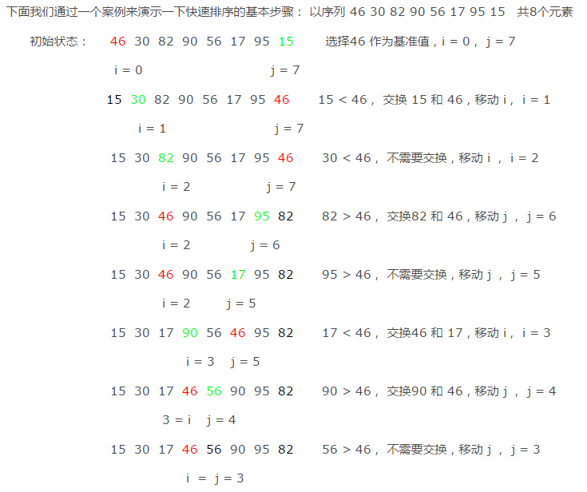

# 排序

排序算法，是将无序数据变为有序的一种算法。通常分为内部排序和外部排序。内部排序是指所有待排序的数据都在内存中，都可以直接访问得到。 外部排序是指数据存储在外部，通常都涉及大量的数据的排序问题，这里我们先不讨论。本文主要介绍主要的内部排序算法。

内部排序按照算法思想的不同，可以分为以下几种类型：

> - 插入排序
> - 选择排序
> - 交换排序
> - 归并排序
> - 基数排序

## 插入排序

插入排序的思想是将一个元素插入到一个已经排序好的序列中，在插入的时候逐个比较带插入元素和有序的序列，找到新插入元素的合适位置，插入到序列中。

### 直接插入排序

最简单的插入排序，直接使用插入排序的思想而没有经过任何的优化过程。

```c
#include <iostream>
#include <vector>
#include <algorithm>

using namespace std;
void print(vector<int> v,int i){
    int count = 0;
    for(auto a : v){
        if(count == i){
            cout<<" : ";
        }
        cout<<a<<" ";
        count ++;
    }
    cout<<endl;
}
vector<int> SimpleInsertSort(vector<int> &a)
{
    int n = a.size();
    // 每次循环，都假设i前面的数字已经排序好了，i是要插入到已排序序列的数字，i之后的数字都是未排序的。
    for(int i = 1; i<n; i++){
        // 打印当前的状态
        print(a,i);
        // 找到当前数字i应当插入的位置
        int curValue = a[i];
        int ii = i;
        if(a[ii]<a[0]){
            //应当插入首位
            while(ii-1>=0){
                a[ii] = a[ii-1];
                ii--;
            }
            a[0] = curValue;
        }else if(a[ii]>=a[ii-1]){
            //应当插入末尾
            continue; //如果应该插入的位置是有序列表的末尾，则什么都不用做。
        }else{
            for(int j=0;j<ii-1;j++){
                if(a[ii]>=a[j] && a[ii]<a[j+1]){
                    //应当插入j之后
                    while(ii-1>j){
                        a[ii] = a[ii-1];
                        ii--;
                    }
                    a[ii] = curValue;
                }
            }
        }
    }
    print(a,a.size());
    return  a;
}
int main() {
    vector<int> v = {49,38,65,97,76,13,27,49};
    auto re = SimpleInsertSort(v);
    return 0;
}
```
运行结果：
```c
49  : 38 65 97 76 13 27 49
38 49  : 65 97 76 13 27 49
38 49 65  : 97 76 13 27 49
38 49 65 97  : 76 13 27 49
38 49 65 76 97  : 13 27 49
13 38 49 65 76 97  : 27 49
13 27 38 49 65 76 97  : 49
13 27 38 49 49 65 76 97
```
简单插入排序的时间复杂度是`o(n^2)`;

### 折半插入排序(二分插入排序)

简单插入排序没有经过任何的过程优化，我们仔细分析简单插入排序的过程，寻找元素应该插入的位置这一过程是可以优化的。因为是在有序序列中查找，所以可以使用二分查找方法缩短查找的时间。该方法被叫做二分插入排序。
STL中`lower_bound(a.begin(),a.end()+ii,a[i]);`实现了二分查找算法，我们直接使用它替换原来的循环语句查找出插入位置即可。
```python
def binary_search(arr, start, end, value):
    while start <= end:
        mid = (start + end) // 2
        if value > arr[mid]:
            start = mid + 1
        else:
            end = mid - 1
    return start
def sort_insert(arr):
    unorder = 1
    while unorder < len(arr):
        ordered = binary_search(arr, 0, unorder-1, arr[unorder])
        current = arr[unorder]
        tmp_index = unorder
        while tmp_index > ordered:
            arr[tmp_index] = arr[tmp_index-1]
            tmp_index -= 1
        arr[ordered] = current
        unorder += 1
    return arr
```
### 二路插入排序

### 缩小增量排序（希尔排序）

## 选择排序

### 简单选择排序

在要排序的一组数中，选出最小（或者最大）的一个数与第1个位置的数交换；然后在剩下的数当中再找最小（或者最大）的与第2个位置的数交换，依次类推，直到第n-1个元素（倒数第二个数）和第n个元素（最后一个数）比较为止。


### 二元选择排序

简单选择排序，每趟循环只能确定一个元素排序后的定位。我们可以考虑改进为每趟循环确定两个元素（当前趟最大和最小记录）的位置,从而减少排序所需的循环次数。改进后对n个数据进行排序，最多只需进行[n/2]趟循环即可。

## 交换排序

### 冒泡排序

冒泡排序总是交换相邻的两个值。

在要排序的一组数中，对当前还未排好序的范围内的全部数，自上而下对相邻的两个数依次进行比较和调整，让较大的数往下沉，较小的往上冒。即：每当两相邻的数比较后发现它们的排序与排序要求相反时，就将它们互换。
```c
void print(vector<int> v,int i){
    int count = 0;
    for(auto a : v){
        if(count == i){
            cout<<" | ";
        }
        cout<<a<<" ";
        count ++;
    }
    cout<<endl;
}

//冒泡排序
vector<int> sortTop(vector<int> &v){
    int tmp;
    for(int j=v.size()-1;j>0;j--){
        print(v,j+1);
        for(int i=0;i<j;i++){
            if(v[i+1] < v[i]){
                tmp = v[i];
                v[i] = v[i+1];
                v[i+1] = tmp;
            }
        }
    }
    return v;
}

int main() {
    vector<int> v = {49,38,65,97,76,13,27,12};
    auto a = sortTop(v);
    print(a);
    return 0;
}
```
运行结果：
```c
49 38 65 97 76 13 27 12
38 49 65 76 13 27 12  | 97
38 49 65 13 27 12  | 76 97
38 49 13 27 12  | 65 76 97
38 13 27 12  | 49 65 76 97
13 27 12  | 38 49 65 76 97
13 12  | 27 38 49 65 76 97
12 13 27 38 49 65 76 97  |
```


## 线性时间排序

比较排序依赖元素之间的比较，所以最优的算法的时间复杂度也不会低于`O(n*logn)`;归并排序，堆排序和快速排序都可以达到这一水平。还有一些不依赖元素之间的比较确定元素顺序的排序算法可以达到更低的时间复杂度。例如：计数排序，基数排序和桶排序。

### 计数排序

计数排序的基本思想是： 开辟一个与最大数的值大小一样的数组，然后把每个数字放到对应的数组中，自然而然就有序了。例如对`[9,23,2,100,34,398,5]`排序，开辟一个a[399]的数组，然后`令a[9] = 1;a[23] = 1;a[2]=1;a[100] = 1; a[34] = 1;a[398] = 1;a[5] = 1`;然后从头开始把有值的元素取出来就自然有了顺序。如果有元素的值相等，例如有2个100，只需要让a[100] = 2就行了。下面看看如何取出排序好的数据。
```c
//计数排序
vector<int> countSort(vector<int> &v){
    //1.找到最大值，开辟数组
    if(v.empty()) return v;
    int maxValue = v[0];
    for(int i=1;i<v.size();i++){
        maxValue = v[i] > maxValue ? v[i] : maxValue;
    }
    //2. 开辟对应的数组并计数
    vector<int> b(maxValue + 1,0);
    for(int i=0;i<v.size();i++){
        b[v[i]] = b[v[i]] + 1;
    }
    //3. 取出结果
    v.clear();
    for(int i=0;i<b.size();i++){
        while(b[i]>0){
            v.push_back(i);
            b[i] = b[i] - 1;
        }
    }
    return v;
}
```
上面的代码只能处理非负数的情况。需要注意的是，计数排序当处理有大量重复数字，而数据的范围不大的时候很有用。
### 基数排序(桶排序)
桶排序是一种时间复杂度可以达到O(n)的排序算法，但是它使用的空间较多，也有较大的限制条件，不适用于所有情况下的排序，只适用特定的情况下的排序。

一种更一般的算法思想是分桶法。它的思想是把元素按照一定的范围分别放在对应的桶中，然后再做相应的处理。分组后处理的复杂度就会降低很多，然后再想办法把每个桶中的结果合并起来。

基数排序专门针对的是整数的排序，（因为字符串也是整数表示的，所以字符串的排序也可以使用桶排序）。这里固定的把桶定为10个，分别对应数字0--9.首先按照个位数字入桶，然后按照十位数字，然后按照百位数字，...直到最高位数字，然后按照顺序取出来就是了。下面以`[521 310 72 373 15 546 385 856 187 147]`为例子说明具体的过程。

```c
// 返回a的第i位数字，
// i = 0 个位
// i = 1 十位
int gg(int a,int i){
    int re;
    while(i>=0){
        re = a % 10;
        a = a / 10;
        i--;
    }
    return re;
}
vector<int> baseSort(vector<int> &v){
    if(v.empty()) return v;
    int maxValue = v[0];
    //找到最大值
    for(int i=0;i<v.size();i++){
        maxValue = v[i] > maxValue ? v[i] : maxValue;
    }
    int high = 0;  // 获得最高位，需要循环这么多次
    while(maxValue){
        maxValue /= 10;
        high ++;
    }
    // i = 0 按照个位入桶，收集
    // i = 1 按照十位入桶，收集
    // ...
    for(int i=0;i<high;i++){
        vector<vector<int>> t(10,vector<int>(0));
        // 入桶操作
        for(int j=0;j<v.size();j++){
            t[ gg(v[j],i) ].push_back(v[j]);
        }
        // 从0号桶开始按照顺序收集
        v.clear();
        for(auto a : t){
            for(auto b : a){
                v.push_back(b);
            }
        }
    }
    return v;
}
```

## 快速排序

快速排序是分治思想的典型应用，它的时间复杂度是`o(nlogn)`,在数据没有特殊的规律的情况下，快速排序是首选的排序方法。它的思想也经常用来出各种算法题目。

快速排序每次选择一个元素作为基准元素， 通过比较其他元素和该元素的大小移动位置，最终把该元素移动到排好序之后它应该处于的位置上。

快速排序通过递归调用上述过程，可以做到 nlogn 的时间复杂度。
快速排序的关键就是实现上述过程，通常叫做 `partition`

在 partiton 中， i 指向的始终是小于基准元素的值， i + 1 可能是 j, 也可能是大于基准元素的值，刚开始的时候 i + 1 == j, 一旦遇到大于基准的值， j++ 而 i 不动， i 和 j 拉开距离， 下一次小于基准的元素出现的时候， 交换的是第一个大于基准元素的值和 j.

循环结束的时候， i 指向的是最后一个小于base的值，所以只要把 i + 1 和 base 交换， base 就放在了排序之后正确的位置上。

该函数返回值的函数是基准元素是第几大(小)。



### C实现
```c
// 快速排序的一趟过程
int partition(int *arr, int left, int right)
{
    int base = arr[right]; // 选择最后一个座位基准元素
    int i = left - 1;
    // 遍历[left, right-1], 每一个都和基准比较，如果小于基准，就交换
    for (int j = left; j < right; j++) {
        if (arr[j] <= arr[base]) {
            i = i + 1;
            swap(arr, i, j);
        }
    }
    swap(arr, i + 1, right);
    return i + 1;
}
```

### Python 实现

```python
def partition(array, begin, end):
    base = array[end]
    i = begin - 1

    for j in range(begin, end):
        if array[j] < base:
            i += 1
            array[i], array[j] = array[j], array[i]
    array[i + 1], array[end] = array[end], array[i + 1]
    return i + 1

# 递归实现快速排序
def quicksort(array, begin, end):
    if begin >= end:
        return
    mid = partition(array, begin, end)
    quicksort(array, begin, mid - 1)
    quicksort(array, mid + 1, end)
    return array

# 非递归实现快速排序
def quickquicksort(array):
    begin = 0
    end = len(array) - 1
    stack = [(begin, end)]
    while len(stack) > 0:
        begin, end = stack.pop()
        if begin >= end:
            continue
        mid = partition(array, begin, end)
        stack.append((begin, mid - 1))
        stack.append((mid + 1, end))
    return array
```

### 应用

#### 第K小的元素

如果查找最小的元素，只需要遍历一遍数组即可。如果是第2小的，首先遍历一遍找到最小的，然后再遍历一遍就可以找到第二小的了。所以，朴素的解法需要的时间复杂度是o(kn),与k有关系。

快速排序`partition`函数的特点是每次能确定一个元素排好序之后应该在的位置。假设partition(0,n-1) = i, 我们可以获得这样的信息，[0..i-1]位置的元素都比A[i]小，而i后面的元素都比A[i]大。这样，我们每次调用`partition`都可以去掉一半元素，这样时间复杂度就能降到o(n)了。

[lintcode](http://lintcode.com/en/problem/kth-largest-element/#)

```c
int Kth(vector<int> &v, int k){
    if(v.empty() || k <= 0) return -1;
    int begin = 0;
    int end = v.size() - 1;
    while(true){
         int i = partition(v,begin,end);
         if(i+1 == k) return v[i];
         if(i+1 < k){
            begin = i + 1;
         }else{
            end = i - 1;
         }
    }
}
```

[leetcode](https://leetcode.com/problems/kth-largest-element-in-an-array/description/)

```c
int partition(vector<int> &v,int i, int j){
    if(i > j) return -1;
    int tmp;
    int start = i;
    int end = j;
    bool base = true; // 指示 i 是否指向base 元素，如果i 不指向base元素，则j肯定指向base元素。
    while(i < j){
        if(v[i] > v[j] && base){
            tmp = v[j];
            v[j] = v[i];
            v[i] = tmp;
            i = i + 1;
            base = false;
        }else if(v[i] > v[j] && !base){
            tmp = v[j];
            v[j] = v[i];
            v[i] = tmp;
            j = j - 1;
            base = true;
        }else if(base){
            j--;
        }else{
            i++;
        }
    }
    return i;
}

int kthLargestElement(vector<int>& nums, int k) {
    int left = 0, right = nums.size() - 1, len = nums.size();
    while (true) {
        int pos = partition(nums, left, right);
        if (len - pos == k ) return nums[pos];
        if (len - pos < k) right = pos - 1;
        else left = pos + 1;
    }
    return -1;
}
```

#### 查找中位数

一般的做法是排序，返回中间的数字，但是这样的时间复杂度是o(nlogn). 其实还有o(n)的算法，和上面一样，也是利用了快速排序的partition函数。

[lintcode](http://lintcode.com/zh-cn/problem/median/)

```c
int median(vector<int> &nums) {
    if(nums.empty()) return -1;
    int len = nums.size();
    return kthLargestElement(nums,len / 2 + 1);
}
```

## 堆排序

堆排序的原理是先用所有元素建堆， 然后每次取堆顶元素放在最后，调整堆， 然后再取堆顶元素，重复该过程直到堆为空。

因为调整堆只需要消耗 logn 的时间， 所以堆排序共需要 nlogn 的时间。

堆排序的关键是实现 **建立堆** 和 **调整堆** 的方法。

```c
// 调整堆中的节点 i， 使得重新满足大顶堆
void heapify(int *arr, int size, int i)
{
    int left = 2 * i + 1;
    int right = 2 * i + 2;
    int large = i;
    if (left < size && arr[left] > arr[large]) {
        large = left;
    }
    if (right < size && arr[right] > arr[large]) {
        large = right;
    }
    // 如果找到子节点中有较大的，和那个较大的交换
    if (large != i) {
        swap(arr, i, large);
        heapify(arr, size, large);
    }
    return;
}

// 建立堆
void build_heap(int *arr, int size)
{
    // 数组后半部分是二叉树的叶子节点，不用调整
    // 对每一个内部节点调整一遍堆，使堆满足条件
    int middle = size / 2;
    for (int i = middle; i >= 0; i++) {
        heapify(arr, size, i);
    }
    return;
}

void heap_sort(int *arr, int size)
{
    int end = size;
    build_heap(arr, end);
    while (end > 0) {
        // 堆顶最大的值放在是最后，堆元素个数减一
        swap(arr, 0, end - 1);
        // 堆顶元素换过，调整它
        heapify(arr, end - 1, 0);
        end--;
    }
    return;
}
```


## 排序方法比较

说明：

当原表有序或基本有序时，直接插入排序和冒泡排序将大大减少比较次数和移动记录的次数，时间复杂度可降至O（n）；

而快速排序则相反，当原表基本有序时，将蜕化为冒泡排序，时间复杂度提高为O（n2）；

原表是否有序，对简单选择排序、堆排序、归并排序和基数排序的时间复杂度影响不大。

## 排序相关题目

|LeetCode题目                                 | 难度  |
|:--------------------------------------------|:-----:|
[215. 数组中的第K个最大元素](../leetcode/215/readme.md) | 中等