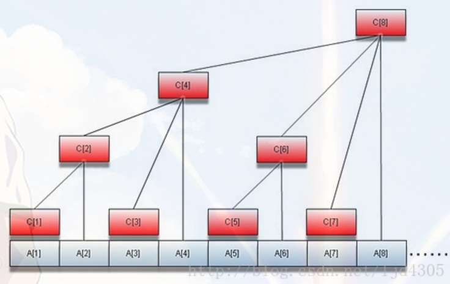

# 树状数组

树状数组是一个能够快速完成下术操作的数据结构：

> - 给定一个初始值全为0的数列，a1,a2,a3,a4,...an
> - 给定i,计算a1+a2+...+ai
> - 给定i和x,计算ai = ai + x;

一句话总结，就是既要快速求解区间和，又要快速更新区间和。

上面提到的线段树其实已经满足了上面的要求，只不过有些(大材小用了)。可以用更简单的结构实现这个要求。



把线段树所有的右节点去掉，只剩下左节点，然后对应的位置不变，投射到最下面一行，就形成了树状数组的结构。例如8个元素的树状数组的结构是：


A[1]|A[2]|A[3]|A[4]|A[5]|A[6]|A[7]|A[8]
---|---|---|---|---|---|---|---
1|[1,2]|3|[1,4]|5|[5,6]|7|[1,8]
0001|0010|0011|0100|0101|0110|0111|1000


## 求和操作

有了上面的结构，如果想求`c[3]+c[4]+c[5]`就是`A[4]-A[2]+A[5]`;
如果想求`c[4]`,就是`A[4]-A[3]-A[2]`; 总之，一个区间内的和总可以在常数时间内通过树状数组中的值求出来。树状数组可以使用位来保存，通过寻找其中的规律，可以使用简单的位操作实现树状数组的求和和更新。上面表格的最后一行是对树状数组A进行的二进制的编码。
求树状数组的前i项和：

|i|表达式|二进制表示|
|--|--|--|
|1|A[1]|0001|
|2|A[2]|0010|
|3|A[3]+A[2]|0011+0010|
|4|A[4]|0100|
|5|A[5]+A[4]|0101+0100|
|6|A[6]+A[4]|0110+0100|
|7|A[7]+A[6]+A[4]|0111+0110+0100|
|8|A[8]|1000|

从二进制当中寻找规律，求前i项：

> 1. 初始化sum=0;
> 2. 从树状数组A[i]开始，把A[i]加入到结果中去。然后从i中减去i最低位1对应的数字。i的最低位的1对应的数字的值的大小可以用`i&(-i)`求得。
> 3. 直到i的结果为0停止。

按照上面的步骤分析上面表格中的每一行的求解：

>- 0001减去最后一位二进制1对应的数字（1）之后为0，所以最后结果是A[1]
>- 0010减去最后一位二进制1对应的数字(2)之后为0，所以最后的结果是A[2]
>- 0011减去最后以为二进制1对应的数字(1)之后为(0010,A[2]),而0010减去最后一位二进制1对应的数字(2)之后为0,所以最后的结果是A[3]+A[2]
>- 0100减去最后以为二进制1对应的数字(4)之后为0,所以最后的结果是A[4]
>- 0101减去最后以为二进制1对应的数字(1)之后为0100,0100减去最后以为二进制1对应的数字(4)之后为0,所以最后的结果是A[5]+A[4]
>- 0110 = 0110 + 0100 = A[6] + A[4]
>- 0111 = 0111 + 0110 + 0100 + A[7] + A[6] + A[4]
>- 1000 = 1000 = A[8]

上面就是BIT数组求和的详细解释，了解了这个过程，在知道如何求解一个数字最低位1对应的值，实现BIT的求和应该不难。下面看看BIT如何更新。
假如我们想更新c[2]的值，那么A中所有包含c[2]的值都可能发生变化，到底哪些值包含c[2]呢？从上面的表格我们看出，包含c[2]的A元素有A[2],A[4],A[8];下面再列一个表格，显示每个元素的更新都涉及哪些元素，这样就比较容易找到其中的规律。

## 更新操作

|更新的值|涉及的BIT|二进制表示|
|--|--|--|
|c[1]|A[1],A[2],A[4],A[8]|0001,0010,0100,1000|
|c[2]|A[2],A[4],A[8]|0010,0100,1000|
|c[3]|A[3],A[4],A[8]|0011,0100,1000|
|c[4]|A[4],A[8]|0100,1000|
|c[5]|A[5],A[6],A[8]|0101,0110,1000|
|c[6]|A[6],A[8]|0110,1000|
|c[7]|A[7],A[8]|0111,1000|
|c[8]|A[8]|1000|

可以看到，更新的时候和求和的时候顺序似乎相反，规律是：如果要更新c[i],那么就从i开始，更新A[i]之后将i更新为`i = i+(i&(-i))`,直到最后一个元素为止。因为无论更新哪个元素，最后一个元素包含所有值的和，所以必须更新最后一个元素。`i&(-i)`是得到i的最后一位二进制1对应的数值的大小，然后加到i上，对比上面的表格。i的更新情况是：

> - 0001(1)-0001+0001(2)-0010+0010(4)-0100+0100(8)=1000 停止
> - 0010(2)-0010+0010(4)-0100+0100(8)=1000 停止
> - 0011(3)-0011+0001(4)-0100+0100(8)=1000 停止
> - 0100(4)-0100+0100(8)=1000 停止
> - 0101(5)-0101+0001(6)-0110+0010(8)=1000 停止
> - 0110(6)-0110+0010(8)=1000 停止
> - 0111(7)-0111+0001(8)=1000 停止
> - 1000(8) = 1000 停止

树状数组的实现：

```c
#include <iostream>
#include <vector>
using namespace std;
class BIT{
public:
    vector<int> v;
    int n;
    BIT(){}
    // 构建n个元素的空树状数组
    BIT(int num){
        n = num+1; // v[0]不用，下标从1开始。
       for(int i=0;i<n;i++){
           v.push_back(0);
       }
    }
    //求前i项的和
    int sum(int i){
        int s = 0;
        while(i>0){
            s += v[i];
            i -= i & (-i);
        }
        return s;
    }
    //第i 项加上x
    void add(int i,int x){
        while(i<=n){
           v[i] += x;
            i += i&(-i);
        }
    }
    //根据传入的数组c构建它的树状数组
    void create(vector<int> &c){
        for(int i=0;i<c.size();i++){
            add(i+1,c[i]);
        }
    }

};
void printV(vector<int> a){
    for(auto aa:a){
        cout<<aa<<" ";
    }
    cout<<endl;
}
int main() {
    vector<int> c = {3,7,6,5,4,2,8,1};
    BIT *b = new BIT(c.size());
    b->create(c);
    printV(b->v);
    b->add(8,10);
    printV(b->v);
    b->add(1,1);
    printV(b->v);
    return 0;
}
```

运行结果：

```
0 3 10 6 21 4 6 8 36
0 3 10 6 21 4 6 8 46
0 4 11 6 22 4 6 8 47
```

可以看到，树状数组仅仅使用位操作就可以实现求和和更新，比线段树的开销要少很多，所以，一些能用树状数组解决的问题，不宜使用线段树。

参考博文：

http://www.cnblogs.com/wuwangchuxin0924/p/5921130.html
http://www.cnblogs.com/GeniusYang/p/5756975.html

## 相关题目

|LeetCode题目                                 | 难度  |
|:--------------------------------------------|:-----:|
[307. 区域和检索 - 数组可修改](../leetcode/307/readme.md)| 中等
[315. 计算右侧小于当前元素的个数  ](../leetcode/315/readme.md) | 困难


