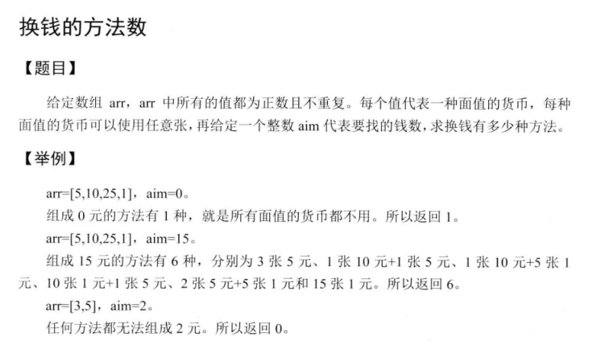

# 动态规划

能用动态规划解决的问题应该满足2个条件：
1. 最优子结构，子问题的最优解可以构成原问题的最优解
2. 反复求解相同的子问题，而不是每次都生成全新的子问题。

动态规划的子问题一般都是重叠的， 分治法解决的子问题一般都是全新的。

## 整数划分问题

一个整数划分成若干整数的和，计算有多少种可能的划分方式。
例如4 = 1 + 1 + 1 + 1 = 2 + 1 + 1 = 2 + 2 = 3 + 1 = 4

dp[i][j] 表示整数 i 的 j 划分的方法数， i 的 j划分的含义是把 i 划分成最大不超过 j的整数的和有多少种划分方法。

如果 j >= i, dp[i][j] = dp[i][i], 因为不可能有超过本身的划分方法，这里不允许有负数。

如果 j < i, dp[i][j] = dp[i][j-1] + dp[i - j][j], i 的 j 划分是两种情况的和：不使用j本身(dp[i][j-1]) + 使用一个j(dp[i-j][j])

```c
int division(int n) {
    int **dp = create_matrix(n + 1, n + 1);
    fill(dp, n + 1, n + 1, 1);
    for (int i = 2; i <= n; i++) {
        for (int j = 2; j <= n; j++) {
            if (j > i) {
                dp[i][j] = dp[i][i];
            } else {
                dp[i][j] = dp[i][j-1] + dp[i-j][j]
            }
        }
    }
    int ans = dp[n][n];
    free_matrix(dp);
    return ans;
}
```

## 背包问题

背包问题是有一个约束条件的最优化问题，即在某个指标不超过某个值的情况下，求另外一个指标的最大值，最小值。

### 0 - 1 背包


#### 使用穷竭搜索

```c
#include <iostream>
#include <vector>
#include <algorithm>
using namespace std;
/**
 * 0--1 背包问题
 * 从第start个物体开始，总重量为weight的背包，返回最大的价值
 * @return
 */
int rec(int start,int weight,vector<int> w,vector<int> v,vector<int> &ob){
    cout<<"rec("<<start<<","<<weight<<")"<<endl;
    int result = 0;
    // 物体的最大个数是w.size()-1,如果超过这个，返回0，含义是从第n个
    //物体开始，得到的价值是0，因为不能放入进去
    if(start == w.size()) {return result;}
    //如果当前物体的重量已经大于总重量，那么一定不能放入背包，
    //一旦放入重量就超过了
    if(w[start] > weight){
        result = rec(start+1,weight,w,v,ob);
    }
    //如果当前物体的重量小于等于最大的重量，那么这个物体可以放入背包，
    //尝试放入和不放入两种情况，选择较大的那个；
//    if(w[start] <= weight){
//        result = max(rec(start+1,weight,w,v),rec(start+1,weight-w[start],w,v)+v[start]);
//    }
    // 记录物品是否放入了背包
    if(w[start] <= weight){
        int noput = rec(start+1,weight,w,v,ob);
        int putted = rec(start+1,weight-w[start],w,v,ob)+v[start];
        if(putted > noput){
            result = putted;
            cout<<"==="<<"rec("<<start<<","<<weight<<")"<<"==="<<endl;
            ob.push_back(start);
        }else{
            result = noput;
        }
    }
    return result;
}
void print(vector<int> v){
    for(auto a : v){
        cout<<a<<" ";
    }
    cout<<endl;
}
int main() {
    vector<int> w = {2,1,3,2};
    vector<int> v = {3,2,4,2};
    int weight = 5;
    vector<int> ob;
    cout<<rec(0,weight,w,v,ob)<<endl;
    print(ob);
    return 0;
}
```

#### 使用动态规划

动态规划的递推公式实际上可以从上面的穷竭搜索中得到。
rec(i,j) 表示从第i个物体开始，在不超过j的重量的情况下，最大的价值是多少
设置dp[i][j] = rec(i,j); 则可以知道dp[n][j] = 0; 因为最多只有n-1个物体；
`dp[i][j] = dp[i+1][j]`         当第i个物体的重量大于j的时候；
`dp[i][i] = max( dp[i+1][j] , dp[i+1][j-w[i]]+v[i] ) `           当第i个物体能够装进去的时候，分别尝试装入和不装入，取最大值。
```C++
/**
 * 背包问题的动态规划解法
 * @param w
 * @param v
 * @param weight
 * @return
 */
int dp(vector<int> w,vector<int> v,int weight){
    int n = w.size();
    vector<vector<int>> dp(n+1,vector<int>(weight+1));
    for(int i=n;i>=0;i--){
        for(int j=0;j<weight+1;j++){
            if(w[i] > j){
                dp[i][j] = dp[i+1][j];
            }else{
                dp[i][j] = max(dp[i+1][j],dp[i+1][j-w[i]] + v[i]);
            }
        }
    }
    print2(dp);
    return dp[0][weight];
}
```

#### 使用状态转移的观点

```c
/**
 * 从状态转移的观点来看
 * dp[i][j] 表示挑选出从0到i物体，总重量不超过j的状态。dp[0][j]表示选择0个物品时的重大价值
 * dp[1][j] 表示选择物体1时候，总重量不超过j的最大的价值
 * 所以有dp[0][j] = 0;
 * dp[i][j] = dp[i-1][j] 当i-1物体不能放入背包时
 * dp[i][j] = dp[i-1][j-w[i]] + v[i] 当i-1物体可以放入背包的时候
 * dp[0][j]
 * @param w
 * @param v
 * @param weight
 * @return
 */
int dp2(vector<int> w,vector<int> v,int weight){
    int n = w.size();
    vector<vector<int>> dp(n+1,vector<int>(weight+1));
    for(int i=0;i<n;i++){
        for(int j=0;j<weight+1;j++){
            if(w[i] > j){
                dp[i+1][j] = dp[i][j];
            }else{
                dp[i+1][j] = max(dp[i][j],dp[i][j-w[i]] + v[i]);
            }
        }
    }
    print2(dp);
    return dp[n][weight];
}
```
### 完全背包


完全背包问题可以这样建立递推关系；
dp[i][j] 表示前i-1个物体放入背包，总重量不超过j的情况下的最大价值。i=0时表示没有物体。
w[i] 和 v[i] 表示第i个物体的重量和价值。注意这里dp中的i和w,v中的i相差1.也就是dp[i+1]对应的物体的重量和价值分别是w[i],v[i];
```C
dp[i+1][j] := dp[i][j]  第i个物体不放入背包
           := dp[i][j-1*w[i]] + v[i] 第i个物体放入1次的时候
		   := dp[i][j-2*w[i]] + 2*v[i] 第i个物体放入2次的时候
		   ...

```
上面的递推关系虽然容易理解，却存在这循环，有重复计算的地方。递推关系还可以定义如下：

>dp[i+1][j] = dp[i][j]   ; 第i个物体无法放入背包的情况
>dp[i+1][j] = d[i+1][j-w[i]]  + v[i]   ; 如果第i个物体可以放入背包，那么最大价值等于 在dp[i+1][j-w[i]]的基础上再放入一个i物品，这时的价值是dp[i+1][j-w[i]] + v[i];
>所以最后的递推关系可以写成：
>dp[0][j] = 0;
>dp[i+1][j] = max(dp[i][j],dp[i+1][j-w[i]] + v[i])


```c
/**
 * 完全背包问题
 * @param w
 * @param v
 * @param weight
 * @return
 */
int dp3(vector<int> w,vector<int> v,int weight){
    int n = w.size();
    vector<vector<int>> dp(n+1,vector<int>(weight+1));
    for(int i=0;i<n;i++){
        for(int j=0;j<=weight;j++){
            if(j<w[i]){
                dp[i+1][j] = dp[i][j];
            }else{
                dp[i+1][j] = max(dp[i][j],dp[i+1][j-w[i]]+v[i]);
            }

        }
    }
    print2(dp);
    return dp[n][weight];
}
```

以上背包的问题的时间复杂度都可以优化到O（nW）也就是物品数量 * 背包容量，空间复杂度可以优化到O（n）.
一般情况下，这样的时间复杂度足够了。但是针对下面这道题，时间复杂度就不够用了，需要另外寻找解题的方法。
> 有n个重量和价值分别为w[i],v[i]的物品，装入容量为W的背包，求最大价值。
> 限制条件：
> n : 1--100 ; w[i] : 1--10000000 ; v[i] : 1--100;  W : 1--1000000000

原来背包问题的时间复杂度是O(nW),但是本题'故意'把W设置的很大，使得不能使用原来的方法求解。
仔细分析数据的取值范围发现，v[i]的范围比较小，我们可以转换思路，求解总重量不超过W的情况下价值的最大值，
就是求解相同价值下的总重量的最小值。
dp[i][j] 表示前i-1个物体在价值不超过j的时候的总重量的最小值。
dp[0][j] = INF; 把不存在最小值的情况设置为最大值，这样是方便用min();
dp[0][0] = 0 ;
dp[i+1][j] = min(dp[i][j],dp[i][j-v[i]]+w[i])

```c
/**
 * 0-1背包的变种
 * @return
 */
int dp4(vector<int> w,vector<int> v,int weight){
    int n = w.size();
    vector<vector<int>> dp(n+1,vector<int>(weight+1));
    dp[0][0] = 0;
    for(int i=0;i<n;i++){
        for(int j=0;j<=weight;j++){
            if(j<v[i]){
                dp[i+1][j] = dp[i][j];
            }else{
                dp[i+1][j] = min(dp[i][j],dp[i+1][j-v[i]]+w[i]);
            }

        }
    }
    print2(dp);
    return dp[n][weight];
}
```

### 多重背包

```python
# 每个物品可以使用ci次
def package_ci(n, c, w, v):
    N = n + 1
    C = c + 1
    dp = [ [0]*N for i in range(C)]
    for i in range(1, N):
        for j in range(1, C):
            if j < w[i]:
                dp[i][j] = dp[i-1][j]
            else:
                for k in range(1, j/w[i]):
                    dp[i][j] = max(dp[i-1][j], dp[i-1][j-k*w[i] + k*v[i]])
    return dp[n][n]

```

## 二维背包问题

一般的背包问题只有一个约束条件，使用二维表格可以完成。
如果有两个约束条件，就必须使用三维的表格才能完成动态规划，这样的问题叫做二维背包。


## 单词切分

给出一个字符串s和一个词典，判断字符串s是否可以被空格切分成一个或多个出现在字典中的单词。
样例

给出

s = "lintcode"

dict = ["lint","code"]

返回 true 因为"lintcode"可以被空格切分成"lint code"

[单词切分](http://lintcode.com/zh-cn/problem/word-break/)

思路一：开一个`dp[n+1]`表示前i个字母能否用空格分割开(按照字典里面给出的单词)。`dp[0]=true`表示空字符串能够分割开，`dp[1]=true`当`s[0]`在字典中存在时。对于`dp[j]`来说，逐个向前搜索，看是否有`s[i,j]`存在与dict中的同时`dp[i-1]`为真。如果有，`dp[j]=true`,如果搜索到头还没有，`dp[j]=false`.这种方法最容易想到，但是时间复杂度高。(不能通过`lintcode`的所有测试用例)

```c
//[单词切分](http://lintcode.com/zh-cn/problem/word-break/)
bool wordBreak(string s, unordered_set<string> &dict) {
    // write your code here
    if(s.empty()) return false;
    vector<bool> dp(s.size()+1,false);
    dp[0] = true;
    for (int i = 1; i <= s.size(); ++i) {
        if(dict.find(s.substr(i-1,1))!=dict.end() && dp[i-1]){
            dp[i] = true;
        }
        int clen = 2;
        for (int j = i - 1; j >= 1 ; --j) {
            string ss = s.substr(j-1,clen);
            if(dict.find(ss) != dict.end() && dp[j-1]){
                dp[i]  = true;
                break;
            }
            clen ++;
        }
    }
    return dp[s.size()];
}
```

思路二：上面的算法每次都会回溯到第一个字符，如果字典的最大的字符的长度远远小于字符串的长度(很常见的情况)，会造成大量的浪费，所以可以改进一下，每次只回溯到字典中最大的字符串长度处，这样就能通过`lintcode`的大规模的数据了。`getMaxLen`用来获取字典中最长的字符串的长度。但是该方法当dict中最大字符串的长度很长时，时间复杂度并没有降低。

```c
int getMaxLen( unordered_set<string> &dict){
    int maxlen = 0;
    for(auto a : dict){
        maxlen = max(maxlen,(int)a.size());
    }
    return maxlen;
}
//[单词切分](http://lintcode.com/zh-cn/problem/word-break/)
bool wordBreak(string s, unordered_set<string> &dict) {
    // write your code here
    if(s.empty() && dict.empty()) return true;
    if(s.empty()) return false;
    vector<bool> dp(s.size()+1,false);
    int maxlen = getMaxLen(dict);
    dp[0] = true;
    for (int i = 1; i <= s.size(); ++i) {
        if(dict.find(s.substr(i-1,1))!=dict.end() && dp[i-1]){
            dp[i] = true;
        }
        int clen = 2;
        int end = max(1,i-1-maxlen);
        for (int j = i - 1; j >= end ; --j) {
            string ss = s.substr(j-1,clen);
            if(dict.find(ss) != dict.end() && dp[j-1]){
                dp[i]  = true;
                break;
            }
            clen ++;
        }
    }
    return dp[s.size()];
}
```

## 换钱的方法数



思路： 动态规划。`dp[i][j]`表示用前`i`种面值的钱组成`j`总共有多少中方案。设钱币的面值一共有N中，组成的面值为M，则需要`N*(M+1)`的数组。第一行表示使用第一种面值的货币组成目标值的方法数量，当`j`能够被整除时，方法数量为1，否则为0. 第一列表示组成目标值`0`有多少种情况，无论有几种面值的货币，只有一种方法，就是一个都不用。

递推公式： 

1. `dp[i][j] = dp[i-1][j] if j < v[i]`, (当面值为`v[i]`的货币比目标值还要大的时候，肯定一张`v[i]`都不能使用，这个时候方法数量等于`dp[-1][j] `).

2. `dp[i][j] = dp[i-1][j] + dp[i][j-v[i]] if j >= v[i]`,   (如果目标值比面值为`v[i]`的钱大，则意味着可以使用`v[i]`若干次，一直到超过目标值； 在这种情况下，组成目标值的总方法数量为以下几种情况的和： 不使用第i中货币组成j, 方法数量是`dp[i-1][j]`; 使用第`i`种货币组成j的数量，`dp[i][j-v[i]]`, 这个式子可以这样理解： 首先使用一张`v[i]`,然后用前`i`中货币组成剩下的`j-v[i]`目标值，这个值之前计算过，可以直接写出来，就是`dp[i][j-v[i]]`;

```c
#include <iostream>
#include <vector>
using namespace std;
int getNum(vector<int> v,int aim){
    vector<vector<int> > dp(v.size(),vector<int>(aim+1));
    //初始化第一列
    for(int i=0;i<v.size();++i){
        dp[i][0] = 1;
    }
    //初始化第一行
    for(int j=1;j<=aim;j++){
        dp[0][j] = j%v[0]==0 ? 1 : 0;
    }
    for(int i=1;i<v.size();++i){
        for(int j=1;j<=aim;++j){
            dp[i][j] = j-v[i]>=0 ? dp[i-1][j]+dp[i][j-v[i]] : dp[i-1][j];
        }
    }
    //打印动态规划表格
    for(int i=0;i<dp.size();++i){
        for(int j=0;j<dp[0].size();++j){
            cout<<dp[i][j]<<"\t";
        }
        cout<<endl;
    }
    return dp[v.size()-1][aim];
}
int main() {
    vector<int> v = {5,2,3,7};
    int aim = 7;
    std::cout << getNum(v,aim) << std::endl;
    return 0;
}
```

## 相关题目

|LeetCode题目                                 | 难度  |
|:--------------------------------------------|:-----:|
[1143. 最长公共子序列](../leetcode/1143/readme.md)| 中等
[516. 最长回文子序列](../leetcode/516/readme.md) | 中等
[1218. 最长定差子序列](../leetcode/1218/readme.md) | 中等

