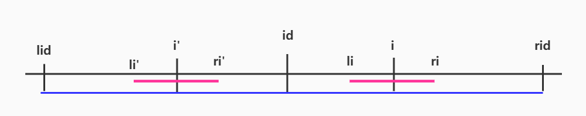

# 回文算法和题目

## Manacher算法

Manacher 是一种可以在线性时间内找到最长回文串的算法，它充分利用了已经找到的回文的对称性，尽量减少字符串比较的次数。

设 `lps[i]` 表示以 i 为中心的回文串的回文半径。例如对于 `abcba`, lps[0] = 1, lps[1] = 1, lps[2] = 3.

设 id 表示一个已经发现的回文的中心位置， `lid`, `rid`分别是其左右边界， `lps[id] = rid - id + 1 = id - lid + 1`.

i > id, 



`i > id`, lps[i] 表示以 i 为中心的回文半径，这个半径可以根据lps[id]左侧的数据得到，因为左右两侧是对称的。

如果 i < rid, 
如果lps[i'] <= rid - i, 则 lps[i] = lps[i'],
如果lps[i'] > rid - i, 则 lps[i] = rid - i.

```python
def manacher(s, DEBUG=True, RETURNSTR=True):
    """
    manacher 算法实现
    """
    # 预处理字符串，每个间隔中插入一个未出现的字符 '#'
    s = '#' + "".join([c + '#' for c in s])
    s = '^' + s + '$' # 首尾附加不同字符避免边界判断
    n = len(s)
    lps = [1] * n

    lid, mid, rid = 0, 0, 0
    i = 1 # s[0] 是 '^'没有必要计算
    center = 0 # 记录最长回文中心位置，用来生成回文
    ans = 0 # 最长回文的长度
    while i < n - 1:
        if i < rid:
            # i' = 2 * mid - i 是 i 关于 mid 的对称点
            lps[i] = min(lps[2 * mid - i], rid - i)

        # lps[i] 初始化为1，因为任意一个字符都是半径为1的回文
        # 以 i 为中心向两边扩展，直到不能再扩展为止
        # 因为首尾新增了两个不一样的字符，所以到边界一定会停止
        while s[i - lps[i]] == s[i + lps[i]]:
            lps[i] += 1

        # 通过上面的循环，我们已经计算出 lps[i]
        # 如果 i + lps[i] > rid, 说明经过扩展边界已经超过 rid
        # 更新 mid 为 i, 因为 lps[i] 已经计算得到
        # 更新 rid 为 mid + lps[mid]
        if rid < i + lps[i]:
            mid = i
            rid = mid + lps[mid]

        # 打印出每次处理完成的状态
        if DEBUG:
            print("=========i: {0}============".format(i))
            print("mid:{0}, lid: {1}, rid: {2}, i': {3}, i:{4}".format(mid, lid, rid, 2*mid - i, i))
            print(s)
            label = [" "] * n
            label[mid] = 'M'
            label[lid] = 'L'
            label[rid] = 'R'
            label[2*mid - i] = 'j'
            label[i] = 'i'
            print("".join(label))
        if RETURNSTR:
            if ans < lps[i] - 1:
                ans = lps[i] - 1
                center = i
        # 如果 i + lps[i] < rid, 说明 i 的边界还没有越过 mid 的边界
        # 可以继续计算 i + 1, 依旧利用 mid 的堆称信息
        i += 1
    
    if not RETURNSTR:
        ans = max(lps) - 1
        return ans

    string = s[center-ans : center + ans]
    string = string.replace("#", "")
    return string

s = "acabcbabc"
ans = manacher(s)
```

## 回文相关题目

|LeetCode题目                                 | 难度  |
|:--------------------------------------------|:-----:|
[5. 最长回文子串](../leetcode/5/readme.md) | 中等
[9. 回文数](../leetcode/9/readme.md) | 简单
