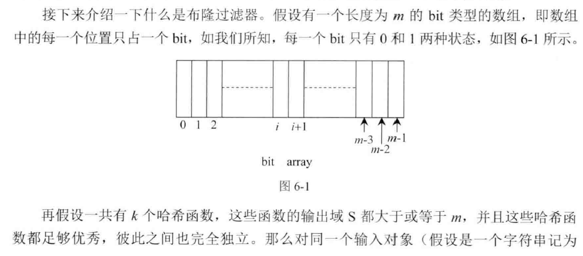
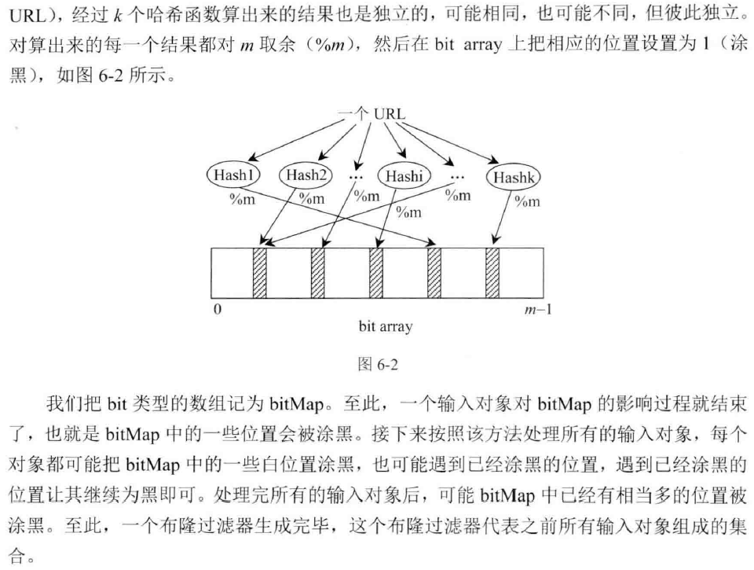

主要介绍一些涉及大量数据的一些算法设计问题。

<!-- more -->

## Bloom filter（布隆过滤器）

宁可错杀三千，绝不放过一个(属于这个集合的肯定不会误判，但是不属于这个集合的却有可能误以为属于这个集合)

布隆过滤器是一种用来处理大数据的查询的一种方式，该方法允许精确的判断一个元素是否属于一个集合。这里的精确是只可以在一定的精度范围内。例如可以以`99.99%`的概率确定一个元素属于还是不属于这个集合。
> 布隆过滤器的优势：
- 使用很少的空间就可以把精确度做的很高。
- 不需要存储元素本身，在某些对保密要求非常严格的场合有优势
- 不需要顾忌单个元素取值范围的大小，因为它与最终布隆过滤器的大小没有关系
（需要注意的是，单个元素的大小必须在散列函数可以表示的范围内）

> 布隆过滤器的缺点：
- 精确度永远不可能达到1
- 从集合中删除某个元素非常困难

布隆过滤器的原理是，当一个元素被加入集合时，通过K个[散列函数](#sanlie)将这个元素映射成一个位数组中的K个点，把它们置为1。检索时，我们只要看看这些点是不是都是1就（大约）知道集合中有没有它了：如果这些点有任何一个0，则被检元素一定不在；如果都是1，则被检元素很可能在。这就是布隆过滤器的基本思想。

### 散列函数

在生成布隆过滤器的时候遇到的对象，判断是否属于这个集合的时候是一定不会出错的。只有生成布隆过滤器的时候没有用到的元素，才可能出错。

布隆过滤器的设计需要考虑两个因素，要表示的数据量n和允许的误差范围p,这里举个例子：n=1000000000, p=0.01。已知数据量和误差范围的时候可以使用如下的公式求解需要布隆数组的位数和需要使用的散列函数的个数。

> - 布隆数组的位数m:
> m = -(n*lnp)/(ln2)^2

> - 散列函数的个数k:
> k = ln2 * (m/n) = 0.7 * m/n;

公式的具体推导过程可以参考[这里]()

参考例题：

## 大文件的处理

把一个大的集合通过哈希函数分配到多台机器中，或者分配到多个文件里，这种技巧是处理面试题中涉及到大数据的时候的最常用的技巧。

### 只用2GB内存在20亿个数中找出出现次数最多的数字

统计出现次数，可以使用哈希表，本题的难点是直接使用哈希表的话，内存是放不下的。

具体做法是：

1. 使用哈希函数将原来包含20亿个整数的文件分割成16个小文件，使得一样的数字在相同的文件中，文件大小尽可能均匀。
2. 分别统计16个小文件的整数出现次数，然后得出最后的结果。

这其实就是分治思想的应用。 关键是使用什么样的哈希函数分割文件，怎样的合并结果策略可以保证得到正确的结果。本题最简单的哈希策略可以是直接用原来的整数当作哈希值，对16取余。余数为0的输出到第一个文件，余数为1的输出到第二个文件，还要注意统计文件中整数的数量，当超过1.25亿的时候就转向下一个文件保存数据，保证16个文件大小的均衡。合并结果的时候，统计每个小文件中出现次数最多的那个，然后判断其他小文件中有没有包含这个数字，有的话，加上，输出最后的结果。

### 40亿个非负整数中没有出现的数字

32位无符号整数可以表示大约42亿个数字，一个文件中存储了40亿个数字，那么即使这40亿个数字都不相同，也存在没有出现过的数字，找出这些数字。

思路：找出没有出现的数字，我们就得有方法记录所有已经出现的数字，只有记住了哪些数字出现过，才可以知道哪些数字没有出现过。所以这个问题是非常费内存的。如何记录40亿个数字的出现呢？ 使用一个40亿长度的数组显然是不能满足内存要求的。 现在考虑如果只用一个比特位表示一个数字是否能满足要求，经过计算，只需要500M的内存基本上就可以了。所以方法是：开辟一个INT32_MAX*2的位数组，记录每个数字出现的情况。遍历完一遍之后，我们就知道了每个数字出现的情况，然后再遍历一遍，遇到0就输出。

现在考虑如何使用更小的内存处理这个问题，例如10M内存，只找出一个未出现的就可以了。

解决的思路是分割处理，例如分割成64个子段，第一次遍历，统计落在每个区间的上的数字的数量，必定有一个区间是不满的，找出这个区间，第二次遍历，只处理落在这个区间上的数字，在对应的位上标记1表示出现过。第三次遍历，遇到是0的就输出，就可以了。

### 

## 一致性哈希算法
